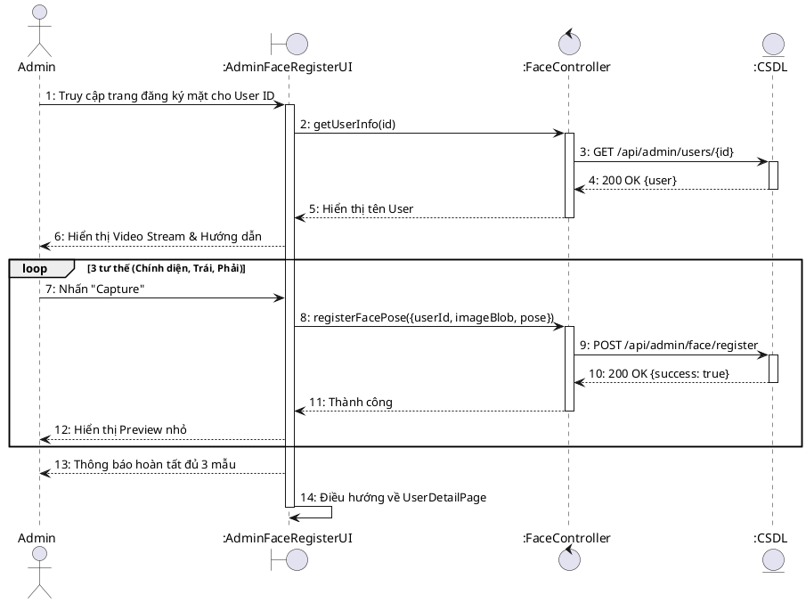
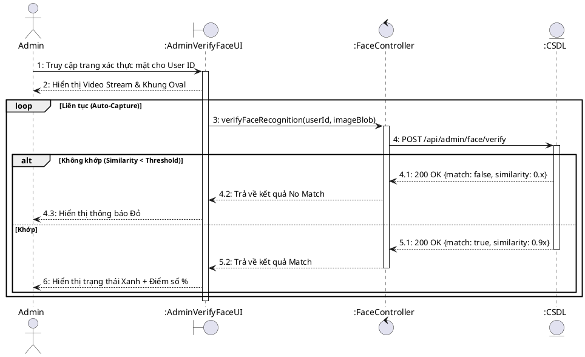
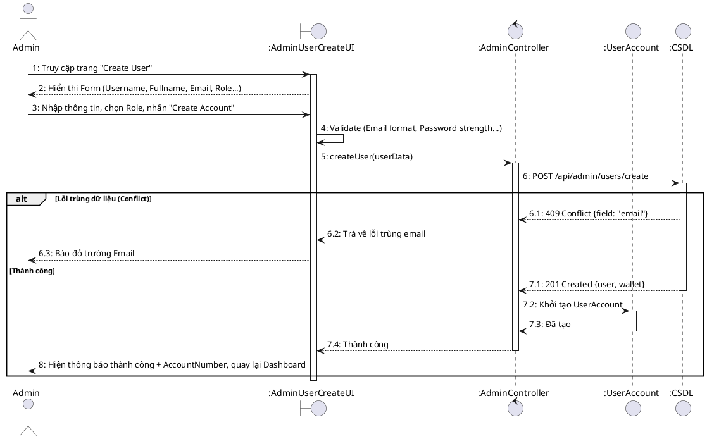
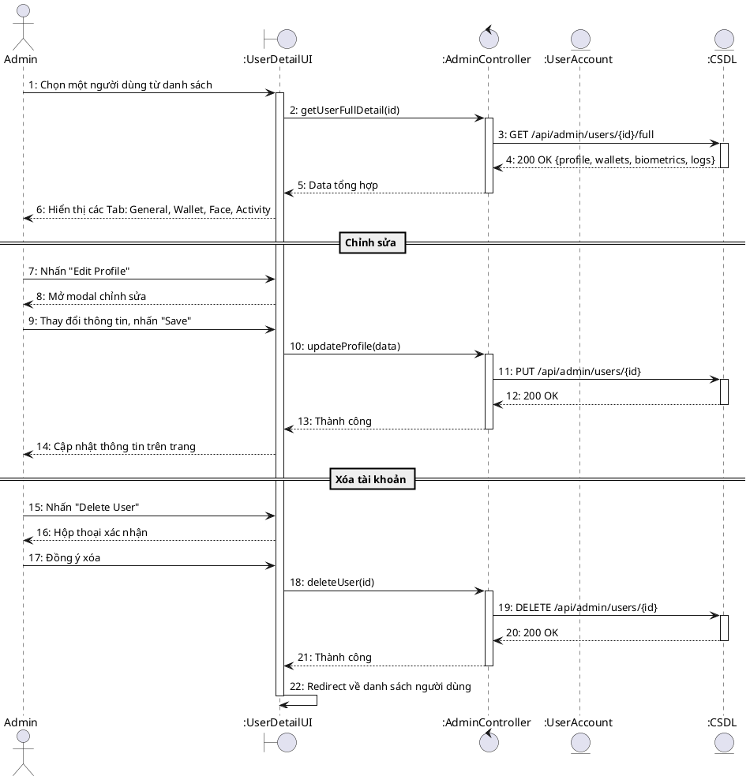

# Sequence Diagram – Admin Face & User Management

## UC-70: Đăng ký sinh trắc học khuôn mặt cho người dùng (Admin)

## UC-71: Kiểm tra xác thực khuôn mặt (Admin Verify)

## UC-72: Khởi tạo tài khoản hệ thống (Admin Create)

## UC-73: Truy soát và cập nhật hồ sơ người dùng

