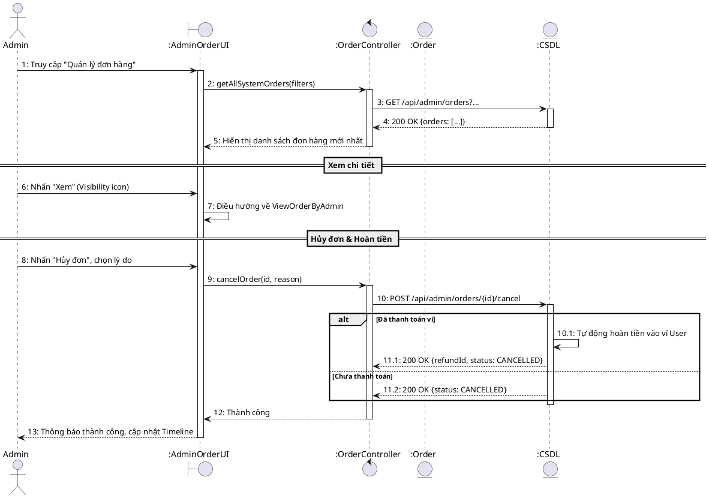

# Sequence Diagram – Admin Order Management

## UC-75: Quản lý và xử lý đơn hàng hệ thống

```plantuml
@startuml UC75_AdminQuanLyDonHang
actor Admin
boundary ":AdminOrderUI" as UI
control ":OrderController" as CTRL
entity ":Order" as ENT
entity ":CSDL" as DB

Admin -> UI : 1: Truy cập "Quản lý đơn hàng"
activate UI

UI -> CTRL : 2: getAllSystemOrders(filters)
activate CTRL
CTRL -> DB : 3: GET /api/admin/orders?...
activate DB
DB --> CTRL : 4: 200 OK {orders: [...]}
deactivate DB
CTRL --> UI : 5: Hiển thị danh sách đơn hàng mới nhất
deactivate CTRL

== Xem chi tiết ==
Admin -> UI : 6: Nhấn "Xem" (Visibility icon)
UI -> UI : 7: Điều hướng về ViewOrderByAdmin

== Hủy đơn & Hoàn tiền ==
Admin -> UI : 8: Nhấn "Hủy đơn", chọn lý do
UI -> CTRL : 9: cancelOrder(id, reason)
activate CTRL
CTRL -> DB : 10: POST /api/admin/orders/{id}/cancel
activate DB
alt Đã thanh toán ví
    DB -> DB : 10.1: Tự động hoàn tiền vào ví User
    DB --> CTRL : 11.1: 200 OK {refundId, status: CANCELLED}
else Chưa thanh toán
    DB --> CTRL : 11.2: 200 OK {status: CANCELLED}
end
deactivate DB
CTRL --> UI : 12: Thành công
deactivate CTRL
UI --> Admin : 13: Thông báo thành công, cập nhật Timeline

deactivate UI
@enduml
```
