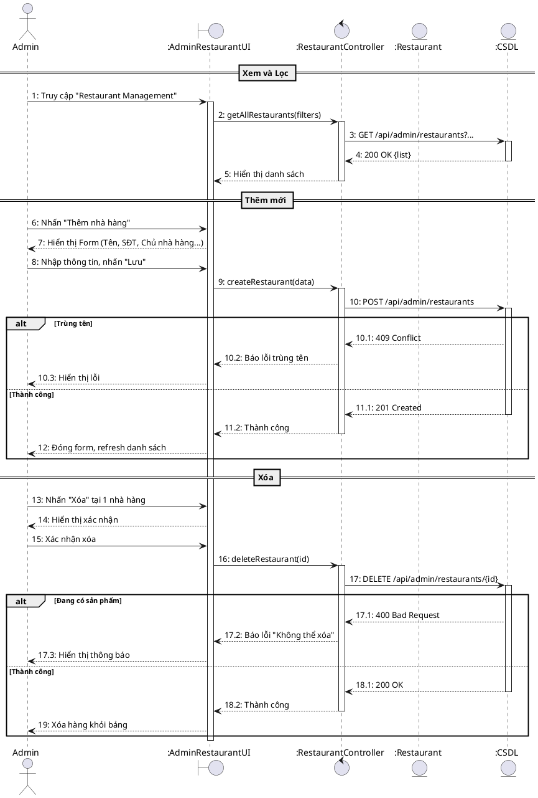
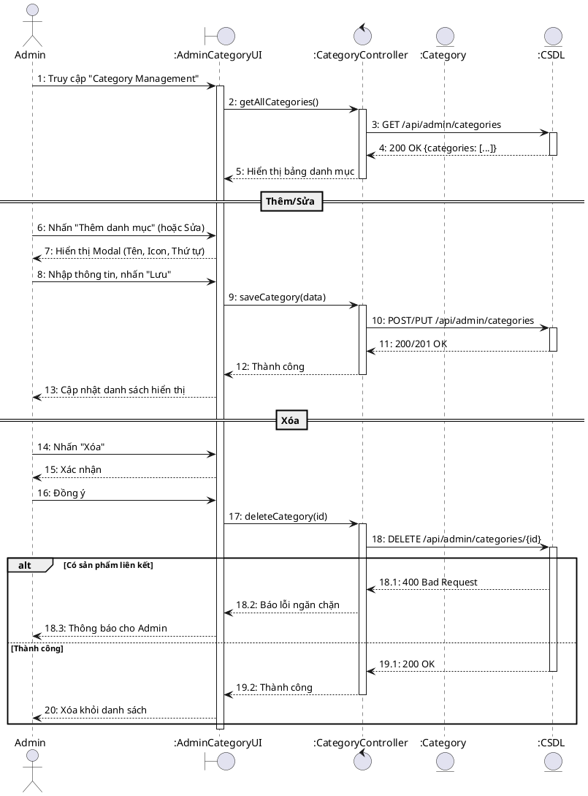

# Sequence Diagram – Admin Restaurant & Category Management

## UC-64: Quản lý nhà hàng đối tác (CRUD)

```plantuml
@startuml UC64_AdminQuanLyNhaHang
actor Admin
boundary ":AdminRestaurantUI" as UI
control ":RestaurantController" as CTRL
entity ":Restaurant" as ENT
entity ":CSDL" as DB

== Xem và Lọc ==
Admin -> UI : 1: Truy cập "Restaurant Management"
activate UI
UI -> CTRL : 2: getAllRestaurants(filters)
activate CTRL
CTRL -> DB : 3: GET /api/admin/restaurants?...
activate DB
DB --> CTRL : 4: 200 OK {list}
deactivate DB
CTRL --> UI : 5: Hiển thị danh sách
deactivate CTRL

== Thêm mới ==
Admin -> UI : 6: Nhấn "Thêm nhà hàng"
UI --> Admin : 7: Hiển thị Form (Tên, SĐT, Chủ nhà hàng...)
Admin -> UI : 8: Nhập thông tin, nhấn "Lưu"
UI -> CTRL : 9: createRestaurant(data)
activate CTRL
CTRL -> DB : 10: POST /api/admin/restaurants
activate DB
alt Trùng tên
    DB --> CTRL : 10.1: 409 Conflict
    CTRL --> UI : 10.2: Báo lỗi trùng tên
    UI --> Admin : 10.3: Hiển thị lỗi
else Thành công
    DB --> CTRL : 11.1: 201 Created
    deactivate DB
    CTRL --> UI : 11.2: Thành công
    deactivate CTRL
    UI --> Admin : 12: Đóng form, refresh danh sách
end

== Xóa ==
Admin -> UI : 13: Nhấn "Xóa" tại 1 nhà hàng
UI --> Admin : 14: Hiển thị xác nhận
Admin -> UI : 15: Xác nhận xóa
UI -> CTRL : 16: deleteRestaurant(id)
activate CTRL
CTRL -> DB : 17: DELETE /api/admin/restaurants/{id}
activate DB
alt Đang có sản phẩm
    DB --> CTRL : 17.1: 400 Bad Request
    CTRL --> UI : 17.2: Báo lỗi "Không thể xóa"
    UI --> Admin : 17.3: Hiển thị thông báo
else Thành công
    DB --> CTRL : 18.1: 200 OK
    deactivate DB
    CTRL --> UI : 18.2: Thành công
    deactivate CTRL
    UI --> Admin : 19: Xóa hàng khỏi bảng
end

deactivate UI
@enduml
```

## UC-65: Quản lý danh mục sản phẩm (Category)

```plantuml
@startuml UC65_AdminQuanLyDanhMuc
actor Admin
boundary ":AdminCategoryUI" as UI
control ":CategoryController" as CTRL
entity ":Category" as ENT
entity ":CSDL" as DB

Admin -> UI : 1: Truy cập "Category Management"
activate UI

UI -> CTRL : 2: getAllCategories()
activate CTRL
CTRL -> DB : 3: GET /api/admin/categories
activate DB
DB --> CTRL : 4: 200 OK {categories: [...]}
deactivate DB
CTRL --> UI : 5: Hiển thị bảng danh mục
deactivate CTRL

== Thêm/Sửa ==
Admin -> UI : 6: Nhấn "Thêm danh mục" (hoặc Sửa)
UI --> Admin : 7: Hiển thị Modal (Tên, Icon, Thứ tự)
Admin -> UI : 8: Nhập thông tin, nhấn "Lưu"
UI -> CTRL : 9: saveCategory(data)
activate CTRL
CTRL -> DB : 10: POST/PUT /api/admin/categories
activate DB
DB --> CTRL : 11: 200/201 OK
deactivate DB
CTRL --> UI : 12: Thành công
deactivate CTRL
UI --> Admin : 13: Cập nhật danh sách hiển thị

== Xóa ==
Admin -> UI : 14: Nhấn "Xóa"
UI --> Admin : 15: Xác nhận
Admin -> UI : 16: Đồng ý
UI -> CTRL : 17: deleteCategory(id)
activate CTRL
CTRL -> DB : 18: DELETE /api/admin/categories/{id}
activate DB
alt Có sản phẩm liên kết
    DB --> CTRL : 18.1: 400 Bad Request
    CTRL --> UI : 18.2: Báo lỗi ngăn chặn
    UI --> Admin : 18.3: Thông báo cho Admin
else Thành công
    DB --> CTRL : 19.1: 200 OK
    deactivate DB
    CTRL --> UI : 19.2: Thành công
    deactivate CTRL
    UI --> Admin : 20: Xóa khỏi danh sách
end

deactivate UI
@enduml
```
