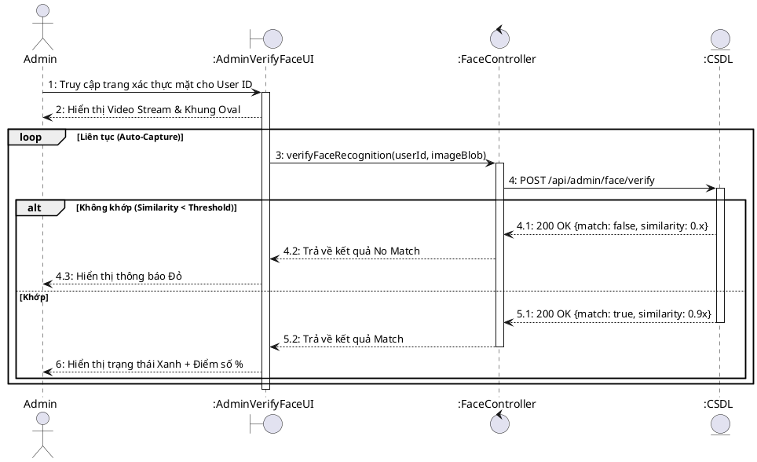

# Sequence Diagram – Admin Verify Face

## UC-71: Kiểm tra xác thực khuôn mặt (Admin Verify)

```plantuml
@startuml UC71_AdminXacThucMat
actor Admin
boundary ":AdminVerifyFaceUI" as UI
control ":FaceController" as CTRL
entity ":CSDL" as DB

Admin -> UI : 1: Truy cập trang xác thực mặt cho User ID
activate UI

UI --> Admin : 2: Hiển thị Video Stream & Khung Oval

loop Liên tục (Auto-Capture)
    UI -> CTRL : 3: verifyFaceRecognition(userId, imageBlob)
    activate CTRL
    CTRL -> DB : 4: POST /api/admin/face/verify
    activate DB
    
    alt Không khớp (Similarity < Threshold)
        DB --> CTRL : 4.1: 200 OK {match: false, similarity: 0.x}
        CTRL --> UI : 4.2: Trả về kết quả No Match
        UI --> Admin : 4.3: Hiển thị thông báo Đỏ
    else Khớp
        DB --> CTRL : 5.1: 200 OK {match: true, similarity: 0.9x}
        deactivate DB
        CTRL --> UI : 5.2: Trả về kết quả Match
        deactivate CTRL
        UI --> Admin : 6: Hiển thị trạng thái Xanh + Điểm số %
    end
end

deactivate UI
@enduml
```
