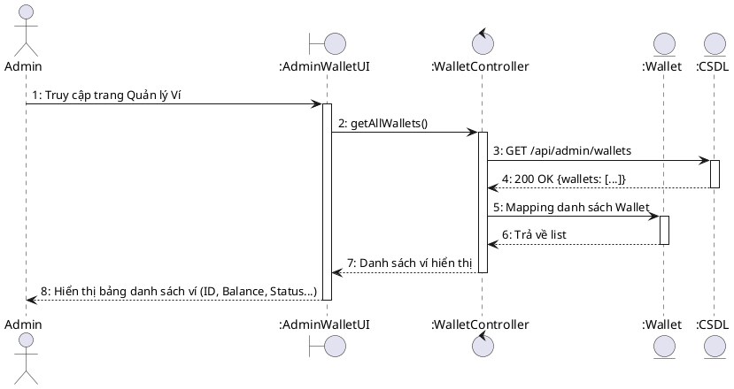
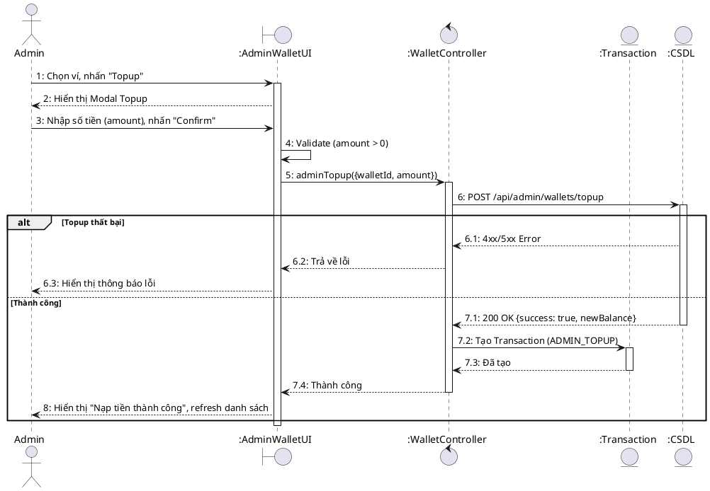
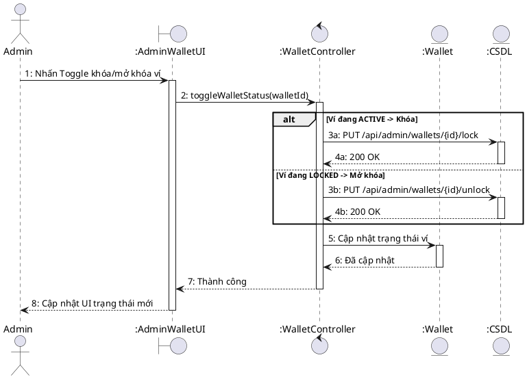
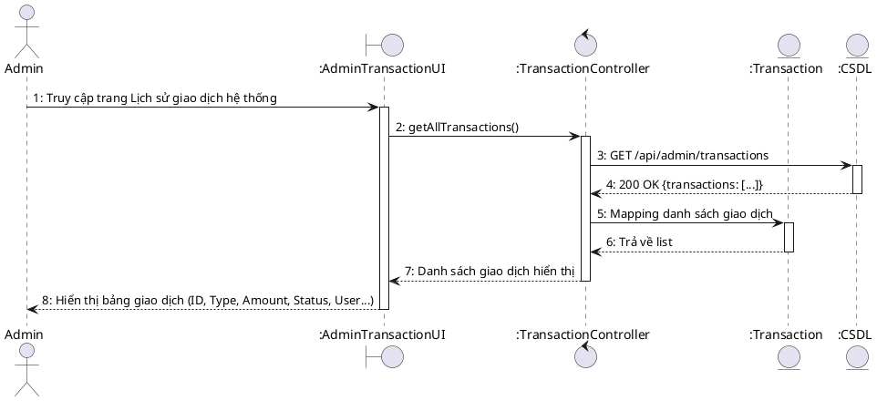
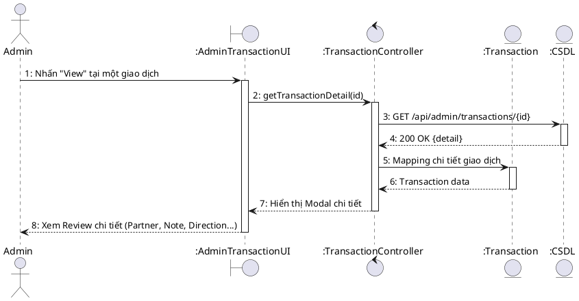

# Sequence Diagram – Admin Wallet Management

## UC-59: Xem danh sách ví điện tử

## UC-60: Nạp tiền vào ví (Admin Topup)

## UC-61: Khóa/Mở khóa ví điện tử

## UC-62: Xem lịch sử giao dịch hệ thống

## UC-63: Xem chi tiết giao dịch

