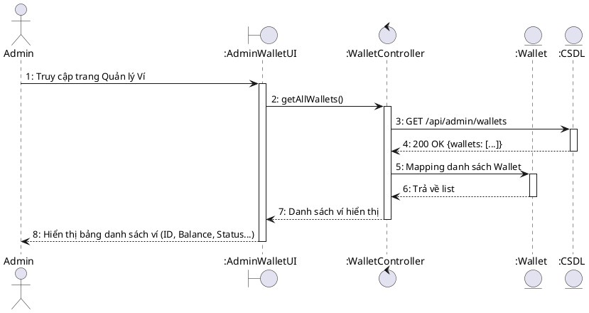

# Sequence Diagram – Admin Wallet Overview

## UC-59: Xem danh sách ví điện tử (Admin)

```plantuml
@startuml UC59_AdminXemVi
actor Admin
boundary ":AdminWalletUI" as UI
control ":WalletController" as CTRL
entity ":Wallet" as ENT
entity ":CSDL" as DB

Admin -> UI : 1: Truy cập trang Quản lý Ví
activate UI

UI -> CTRL : 2: getAllWallets()
activate CTRL

CTRL -> DB : 3: GET /api/admin/wallets
activate DB
DB --> CTRL : 4: 200 OK {wallets: [...]}
deactivate DB

CTRL -> ENT : 5: Mapping danh sách Wallet
activate ENT
ENT --> CTRL : 6: Trả về list
deactivate ENT

CTRL --> UI : 7: Danh sách ví hiển thị
deactivate CTRL

UI --> Admin : 8: Hiển thị bảng danh sách ví (ID, Balance, Status...)
deactivate UI
@enduml
```
