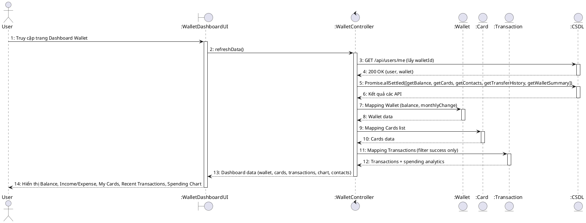
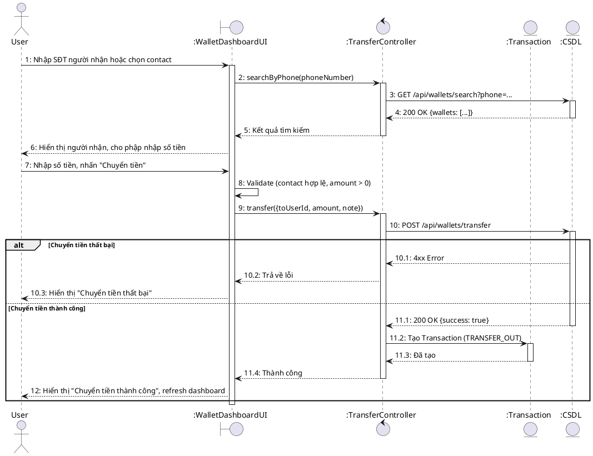
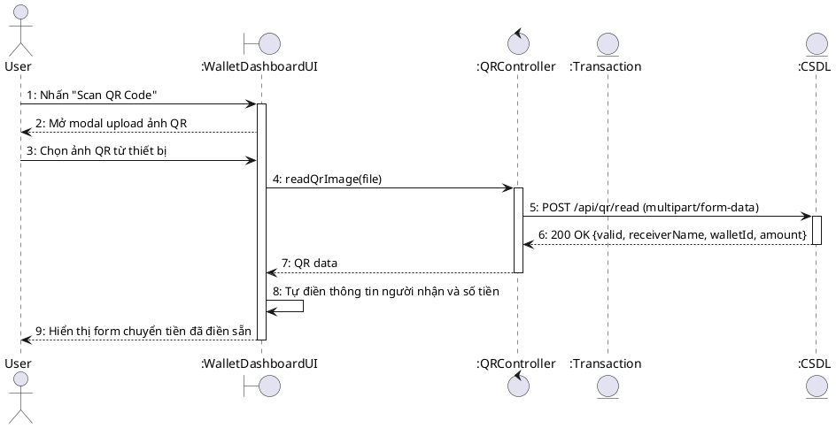
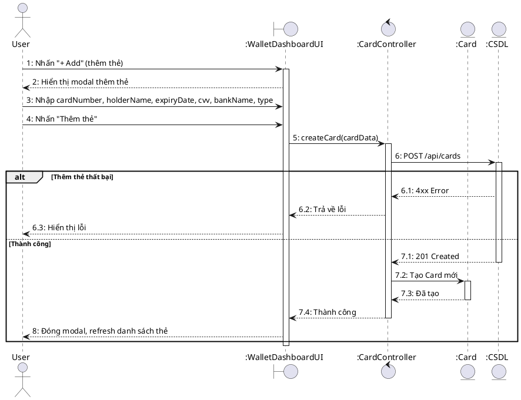
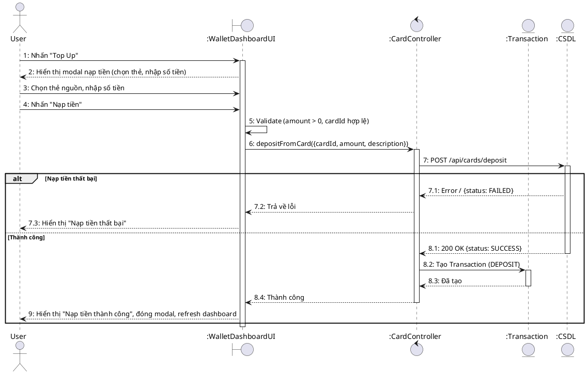

# Sequence Diagram – DashboardPage.jsx (Wallet)

## UC-23: Xem tổng quan ví điện tử

## UC-24: Chuyển tiền nhanh (Quick Transfer)

## UC-25: Quét QR chuyển tiền

## UC-26: Thêm thẻ ngân hàng

## UC-27: Nạp tiền vào ví (Topup)

