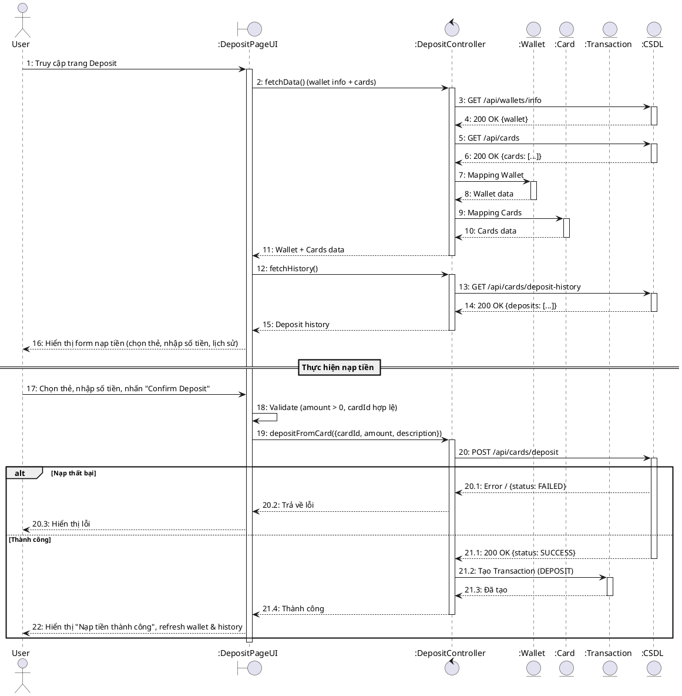

# Sequence Diagram – DepositPage.jsx

## UC-28: Nạp tiền vào ví từ thẻ ngân hàng

```plantuml
@startuml UC28_NapTienTuThe
actor User
boundary ":DepositPageUI" as UI
control ":DepositController" as CTRL
entity ":Wallet" as ENTW
entity ":Card" as ENTC
entity ":Transaction" as ENTT
entity ":CSDL" as DB

User -> UI : 1: Truy cập trang Deposit
activate UI

UI -> CTRL : 2: fetchData() (wallet info + cards)
activate CTRL

CTRL -> DB : 3: GET /api/wallets/info
activate DB
DB --> CTRL : 4: 200 OK {wallet}
deactivate DB

CTRL -> DB : 5: GET /api/cards
activate DB
DB --> CTRL : 6: 200 OK {cards: [...]}
deactivate DB

CTRL -> ENTW : 7: Mapping Wallet
activate ENTW
ENTW --> CTRL : 8: Wallet data
deactivate ENTW

CTRL -> ENTC : 9: Mapping Cards
activate ENTC
ENTC --> CTRL : 10: Cards data
deactivate ENTC

CTRL --> UI : 11: Wallet + Cards data
deactivate CTRL

UI -> CTRL : 12: fetchHistory()
activate CTRL
CTRL -> DB : 13: GET /api/cards/deposit-history
activate DB
DB --> CTRL : 14: 200 OK {deposits: [...]}
deactivate DB
CTRL --> UI : 15: Deposit history
deactivate CTRL

UI --> User : 16: Hiển thị form nạp tiền (chọn thẻ, nhập số tiền, lịch sử)

== Thực hiện nạp tiền ==
User -> UI : 17: Chọn thẻ, nhập số tiền, nhấn "Confirm Deposit"

UI -> UI : 18: Validate (amount > 0, cardId hợp lệ)

UI -> CTRL : 19: depositFromCard({cardId, amount, description})
activate CTRL

CTRL -> DB : 20: POST /api/cards/deposit
activate DB

alt Nạp thất bại
    DB --> CTRL : 20.1: Error / {status: FAILED}
    CTRL --> UI : 20.2: Trả về lỗi
    UI --> User : 20.3: Hiển thị lỗi
else Thành công
    DB --> CTRL : 21.1: 200 OK {status: SUCCESS}
    deactivate DB

    CTRL -> ENTT : 21.2: Tạo Transaction (DEPOSIT)
    activate ENTT
    ENTT --> CTRL : 21.3: Đã tạo
    deactivate ENTT

    CTRL --> UI : 21.4: Thành công
    deactivate CTRL

    UI --> User : 22: Hiển thị "Nạp tiền thành công", refresh wallet & history
end

deactivate UI
@enduml
```
