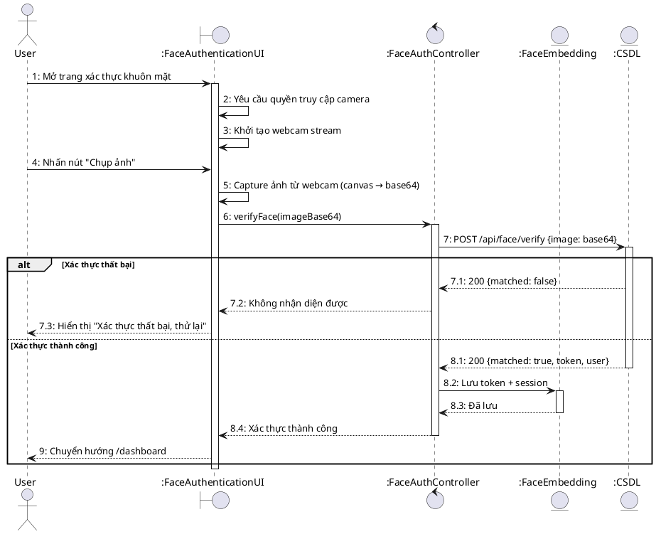
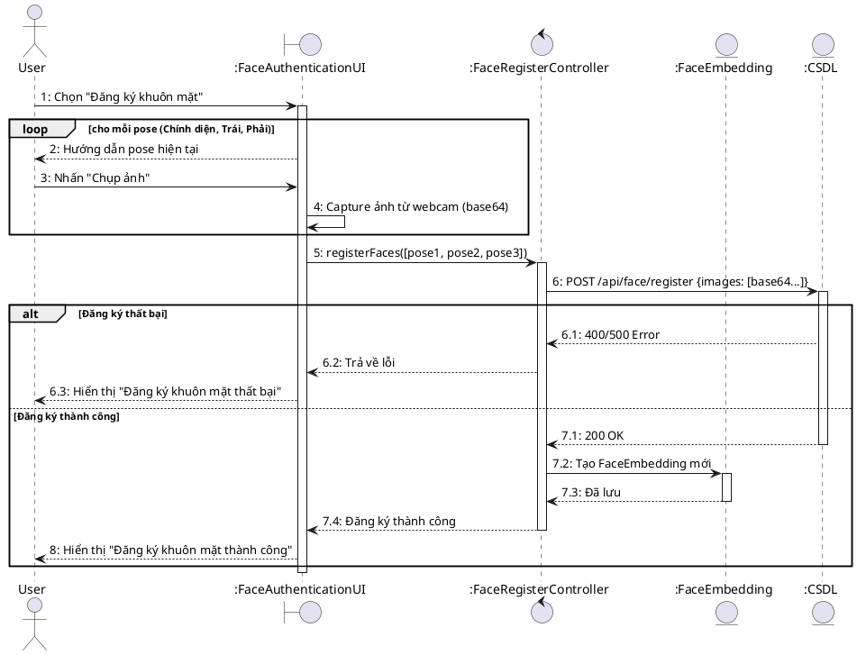

# Sequence Diagram – FaceAuthenticationPage.jsx

## UC-03: Xác thực khuôn mặt (Face Verification)

```plantuml
@startuml UC03_XacThucKhuonMat
actor User
boundary ":FaceAuthenticationUI" as UI
control ":FaceAuthController" as CTRL
entity ":FaceEmbedding" as ENT
entity ":CSDL" as DB

User -> UI : 1: Mở trang xác thực khuôn mặt
activate UI

UI -> UI : 2: Yêu cầu quyền truy cập camera
UI -> UI : 3: Khởi tạo webcam stream

User -> UI : 4: Nhấn nút "Chụp ảnh"
UI -> UI : 5: Capture ảnh từ webcam (canvas → base64)

UI -> CTRL : 6: verifyFace(imageBase64)
activate CTRL

CTRL -> DB : 7: POST /api/face/verify {image: base64}
activate DB

alt Xác thực thất bại
    DB --> CTRL : 7.1: 200 {matched: false}
    CTRL --> UI : 7.2: Không nhận diện được
    UI --> User : 7.3: Hiển thị "Xác thực thất bại, thử lại"
else Xác thực thành công
    DB --> CTRL : 8.1: 200 {matched: true, token, user}
    deactivate DB

    CTRL -> ENT : 8.2: Lưu token + session
    activate ENT
    ENT --> CTRL : 8.3: Đã lưu
    deactivate ENT

    CTRL --> UI : 8.4: Xác thực thành công
    deactivate CTRL

    UI --> User : 9: Chuyển hướng /dashboard
end

deactivate UI
@enduml
```

## UC-04: Đăng ký khuôn mặt (Face Registration – 3 poses)

```plantuml
@startuml UC04_DangKyKhuonMat
actor User
boundary ":FaceAuthenticationUI" as UI
control ":FaceRegisterController" as CTRL
entity ":FaceEmbedding" as ENT
entity ":CSDL" as DB

User -> UI : 1: Chọn "Đăng ký khuôn mặt"
activate UI

loop cho mỗi pose (Chính diện, Trái, Phải)
    UI --> User : 2: Hướng dẫn pose hiện tại
    User -> UI : 3: Nhấn "Chụp ảnh"
    UI -> UI : 4: Capture ảnh từ webcam (base64)
end

UI -> CTRL : 5: registerFaces([pose1, pose2, pose3])
activate CTRL

CTRL -> DB : 6: POST /api/face/register {images: [base64...]}
activate DB

alt Đăng ký thất bại
    DB --> CTRL : 6.1: 400/500 Error
    CTRL --> UI : 6.2: Trả về lỗi
    UI --> User : 6.3: Hiển thị "Đăng ký khuôn mặt thất bại"
else Đăng ký thành công
    DB --> CTRL : 7.1: 200 OK
    deactivate DB

    CTRL -> ENT : 7.2: Tạo FaceEmbedding mới
    activate ENT
    ENT --> CTRL : 7.3: Đã lưu
    deactivate ENT

    CTRL --> UI : 7.4: Đăng ký thành công
    deactivate CTRL

    UI --> User : 8: Hiển thị "Đăng ký khuôn mặt thành công"
end

deactivate UI
@enduml
```
