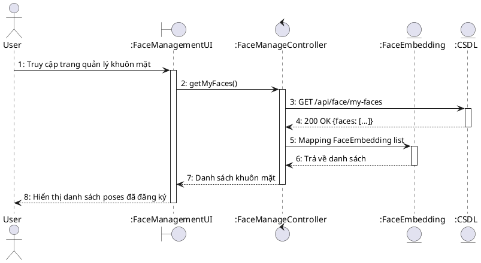
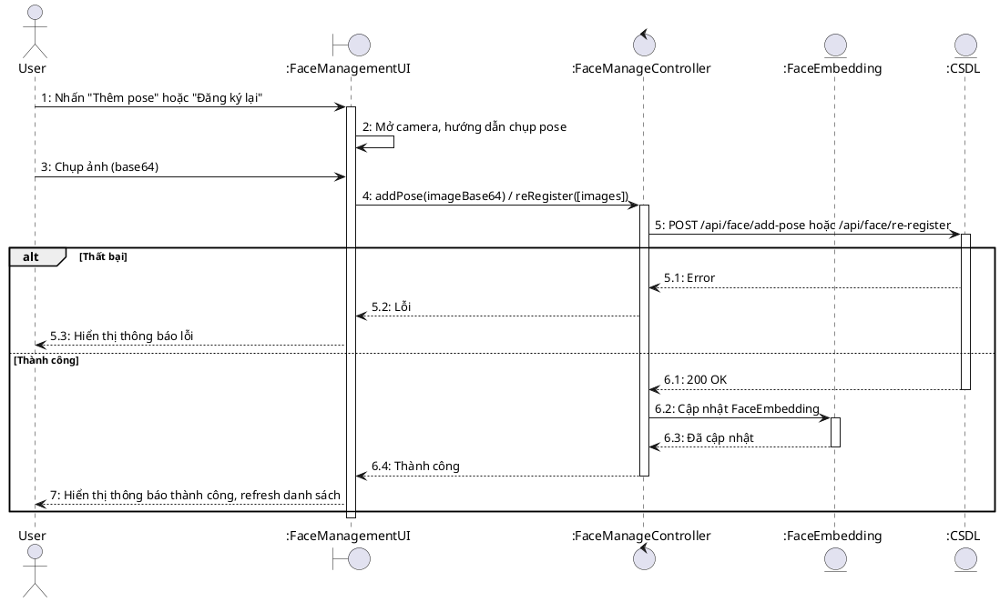

# Sequence Diagram – FaceManagementPage.jsx

## UC-06: Xem danh sách khuôn mặt đã đăng ký

```plantuml
@startuml UC06_XemDanhSachKhuonMat
actor User
boundary ":FaceManagementUI" as UI
control ":FaceManageController" as CTRL
entity ":FaceEmbedding" as ENT
entity ":CSDL" as DB

User -> UI : 1: Truy cập trang quản lý khuôn mặt
activate UI

UI -> CTRL : 2: getMyFaces()
activate CTRL

CTRL -> DB : 3: GET /api/face/my-faces
activate DB

DB --> CTRL : 4: 200 OK {faces: [...]}
deactivate DB

CTRL -> ENT : 5: Mapping FaceEmbedding list
activate ENT
ENT --> CTRL : 6: Trả về danh sách
deactivate ENT

CTRL --> UI : 7: Danh sách khuôn mặt
deactivate CTRL

UI --> User : 8: Hiển thị danh sách poses đã đăng ký
deactivate UI
@enduml
```

## UC-07: Thêm pose mới / Đăng ký lại toàn bộ

```plantuml
@startuml UC07_ThemPoseMoi
actor User
boundary ":FaceManagementUI" as UI
control ":FaceManageController" as CTRL
entity ":FaceEmbedding" as ENT
entity ":CSDL" as DB

User -> UI : 1: Nhấn "Thêm pose" hoặc "Đăng ký lại"
activate UI

UI -> UI : 2: Mở camera, hướng dẫn chụp pose

User -> UI : 3: Chụp ảnh (base64)

UI -> CTRL : 4: addPose(imageBase64) / reRegister([images])
activate CTRL

CTRL -> DB : 5: POST /api/face/add-pose hoặc /api/face/re-register
activate DB

alt Thất bại
    DB --> CTRL : 5.1: Error
    CTRL --> UI : 5.2: Lỗi
    UI --> User : 5.3: Hiển thị thông báo lỗi
else Thành công
    DB --> CTRL : 6.1: 200 OK
    deactivate DB

    CTRL -> ENT : 6.2: Cập nhật FaceEmbedding
    activate ENT
    ENT --> CTRL : 6.3: Đã cập nhật
    deactivate ENT

    CTRL --> UI : 6.4: Thành công
    deactivate CTRL

    UI --> User : 7: Hiển thị thông báo thành công, refresh danh sách
end

deactivate UI
@enduml
```
