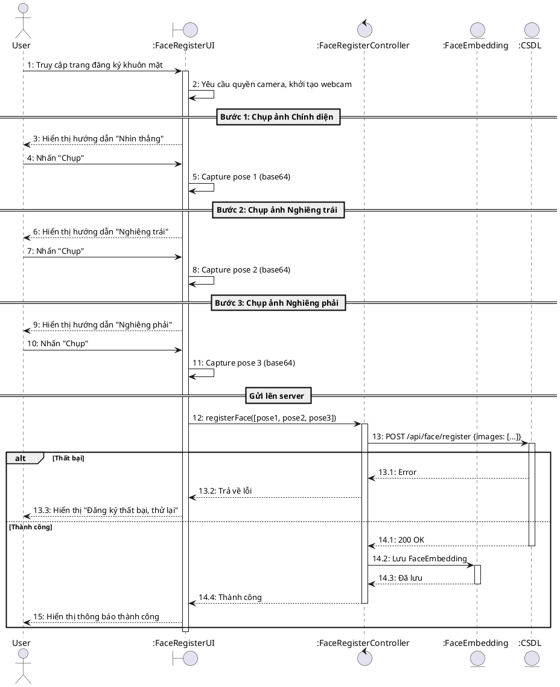

# Sequence Diagram – FaceRegisterPage.jsx

## UC-05: Đăng ký khuôn mặt (Wizard – 3 bước)

```plantuml
@startuml UC05_DangKyKhuonMatWizard
actor User
boundary ":FaceRegisterUI" as UI
control ":FaceRegisterController" as CTRL
entity ":FaceEmbedding" as ENT
entity ":CSDL" as DB

User -> UI : 1: Truy cập trang đăng ký khuôn mặt
activate UI

UI -> UI : 2: Yêu cầu quyền camera, khởi tạo webcam

== Bước 1: Chụp ảnh Chính diện ==
UI --> User : 3: Hiển thị hướng dẫn "Nhìn thẳng"
User -> UI : 4: Nhấn "Chụp"
UI -> UI : 5: Capture pose 1 (base64)

== Bước 2: Chụp ảnh Nghiêng trái ==
UI --> User : 6: Hiển thị hướng dẫn "Nghiêng trái"
User -> UI : 7: Nhấn "Chụp"
UI -> UI : 8: Capture pose 2 (base64)

== Bước 3: Chụp ảnh Nghiêng phải ==
UI --> User : 9: Hiển thị hướng dẫn "Nghiêng phải"
User -> UI : 10: Nhấn "Chụp"
UI -> UI : 11: Capture pose 3 (base64)

== Gửi lên server ==
UI -> CTRL : 12: registerFace([pose1, pose2, pose3])
activate CTRL

CTRL -> DB : 13: POST /api/face/register {images: [...]}
activate DB

alt Thất bại
    DB --> CTRL : 13.1: Error
    CTRL --> UI : 13.2: Trả về lỗi
    UI --> User : 13.3: Hiển thị "Đăng ký thất bại, thử lại"
else Thành công
    DB --> CTRL : 14.1: 200 OK
    deactivate DB

    CTRL -> ENT : 14.2: Lưu FaceEmbedding
    activate ENT
    ENT --> CTRL : 14.3: Đã lưu
    deactivate ENT

    CTRL --> UI : 14.4: Thành công
    deactivate CTRL

    UI --> User : 15: Hiển thị thông báo thành công
end

deactivate UI
@enduml
```
