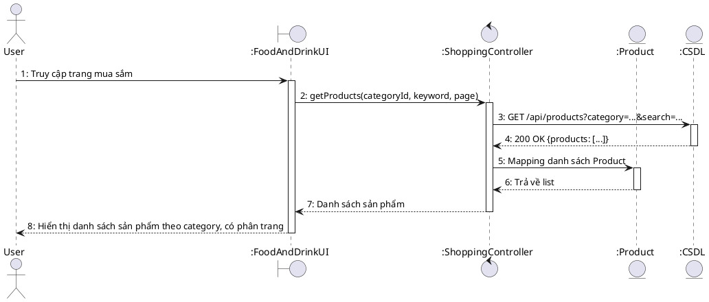
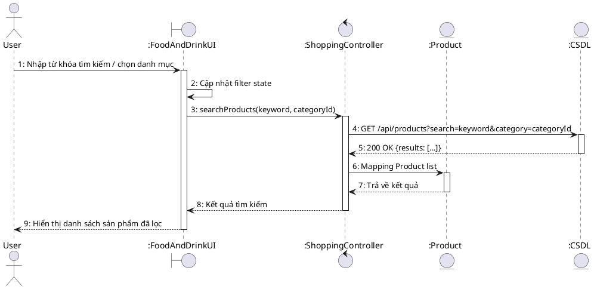
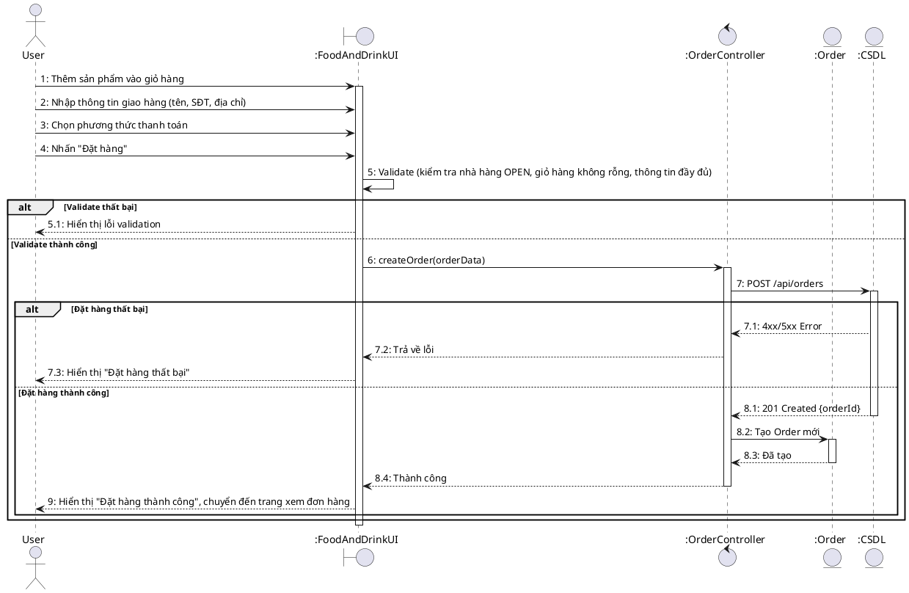

# Sequence Diagram – FoodAndDrinkPage.jsx

## UC-12: Xem danh sách sản phẩm

```plantuml
@startuml UC12_XemSanPham
actor User
boundary ":FoodAndDrinkUI" as UI
control ":ShoppingController" as CTRL
entity ":Product" as ENT
entity ":CSDL" as DB

User -> UI : 1: Truy cập trang mua sắm
activate UI

UI -> CTRL : 2: getProducts(categoryId, keyword, page)
activate CTRL

CTRL -> DB : 3: GET /api/products?category=...&search=...
activate DB
DB --> CTRL : 4: 200 OK {products: [...]}
deactivate DB

CTRL -> ENT : 5: Mapping danh sách Product
activate ENT
ENT --> CTRL : 6: Trả về list
deactivate ENT

CTRL --> UI : 7: Danh sách sản phẩm
deactivate CTRL

UI --> User : 8: Hiển thị danh sách sản phẩm theo category, có phân trang
deactivate UI
@enduml
```

## UC-13: Tìm kiếm và lọc sản phẩm

```plantuml
@startuml UC13_TimKiemSanPham
actor User
boundary ":FoodAndDrinkUI" as UI
control ":ShoppingController" as CTRL
entity ":Product" as ENT
entity ":CSDL" as DB

User -> UI : 1: Nhập từ khóa tìm kiếm / chọn danh mục
activate UI

UI -> UI : 2: Cập nhật filter state

UI -> CTRL : 3: searchProducts(keyword, categoryId)
activate CTRL

CTRL -> DB : 4: GET /api/products?search=keyword&category=categoryId
activate DB
DB --> CTRL : 5: 200 OK {results: [...]}
deactivate DB

CTRL -> ENT : 6: Mapping Product list
activate ENT
ENT --> CTRL : 7: Trả về kết quả
deactivate ENT

CTRL --> UI : 8: Kết quả tìm kiếm
deactivate CTRL

UI --> User : 9: Hiển thị danh sách sản phẩm đã lọc
deactivate UI
@enduml
```

## UC-14: Đặt hàng (Checkout)

```plantuml
@startuml UC14_DatHang
actor User
boundary ":FoodAndDrinkUI" as UI
control ":OrderController" as CTRL
entity ":Order" as ENT
entity ":CSDL" as DB

User -> UI : 1: Thêm sản phẩm vào giỏ hàng
activate UI

User -> UI : 2: Nhập thông tin giao hàng (tên, SĐT, địa chỉ)
User -> UI : 3: Chọn phương thức thanh toán
User -> UI : 4: Nhấn "Đặt hàng"

UI -> UI : 5: Validate (kiểm tra nhà hàng OPEN, giỏ hàng không rỗng, thông tin đầy đủ)

alt Validate thất bại
    UI --> User : 5.1: Hiển thị lỗi validation
else Validate thành công
    UI -> CTRL : 6: createOrder(orderData)
    activate CTRL

    CTRL -> DB : 7: POST /api/orders
    activate DB

    alt Đặt hàng thất bại
        DB --> CTRL : 7.1: 4xx/5xx Error
        CTRL --> UI : 7.2: Trả về lỗi
        UI --> User : 7.3: Hiển thị "Đặt hàng thất bại"
    else Đặt hàng thành công
        DB --> CTRL : 8.1: 201 Created {orderId}
        deactivate DB

        CTRL -> ENT : 8.2: Tạo Order mới
        activate ENT
        ENT --> CTRL : 8.3: Đã tạo
        deactivate ENT

        CTRL --> UI : 8.4: Thành công
        deactivate CTRL

        UI --> User : 9: Hiển thị "Đặt hàng thành công", chuyển đến trang xem đơn hàng
    end
end

deactivate UI
@enduml
```
