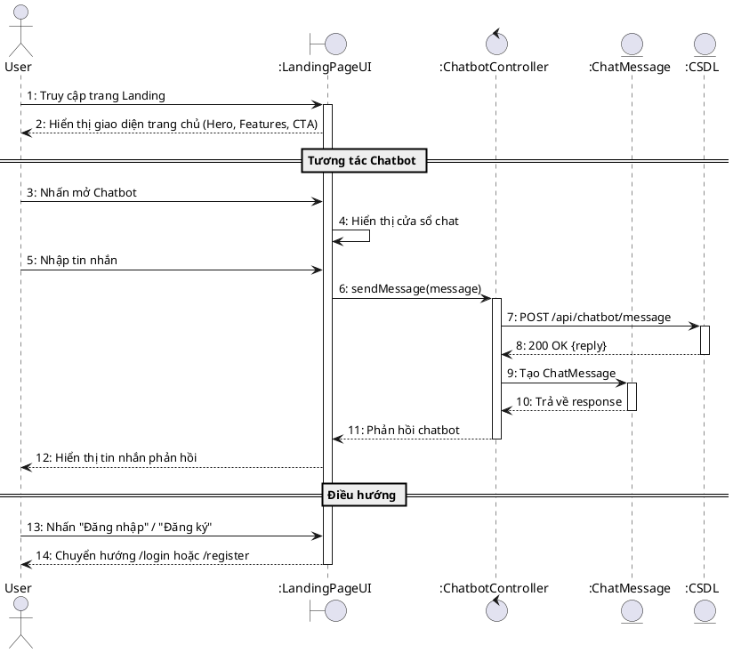

# Sequence Diagram – LandingPage.jsx

## UC-11: Xem trang chủ và tương tác Chatbot

```plantuml
@startuml UC11_TrangChu
actor User
boundary ":LandingPageUI" as UI
control ":ChatbotController" as CTRL
entity ":ChatMessage" as ENT
entity ":CSDL" as DB

User -> UI : 1: Truy cập trang Landing
activate UI
UI --> User : 2: Hiển thị giao diện trang chủ (Hero, Features, CTA)

== Tương tác Chatbot ==
User -> UI : 3: Nhấn mở Chatbot
UI -> UI : 4: Hiển thị cửa sổ chat

User -> UI : 5: Nhập tin nhắn
UI -> CTRL : 6: sendMessage(message)
activate CTRL

CTRL -> DB : 7: POST /api/chatbot/message
activate DB
DB --> CTRL : 8: 200 OK {reply}
deactivate DB

CTRL -> ENT : 9: Tạo ChatMessage
activate ENT
ENT --> CTRL : 10: Trả về response
deactivate ENT

CTRL --> UI : 11: Phản hồi chatbot
deactivate CTRL

UI --> User : 12: Hiển thị tin nhắn phản hồi

== Điều hướng ==
User -> UI : 13: Nhấn "Đăng nhập" / "Đăng ký"
UI --> User : 14: Chuyển hướng /login hoặc /register

deactivate UI
@enduml
```
