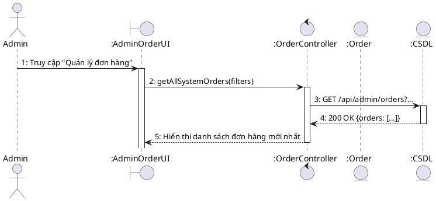

# Sequence Diagram – Order List Management (Admin)

## UC-75: Quản lý và xử lý đơn hàng hệ thống

```plantuml
@startuml UC75_AdminQuanLyDonHang
actor Admin
boundary ":AdminOrderUI" as UI
control ":OrderController" as CTRL
entity ":Order" as ENT
entity ":CSDL" as DB

Admin -> UI : 1: Truy cập "Quản lý đơn hàng"
activate UI

UI -> CTRL : 2: getAllSystemOrders(filters)
activate CTRL
CTRL -> DB : 3: GET /api/admin/orders?...
activate DB
DB --> CTRL : 4: 200 OK {orders: [...]}
deactivate DB
CTRL --> UI : 5: Hiển thị danh sách đơn hàng mới nhất
deactivate CTRL
@enduml
```
