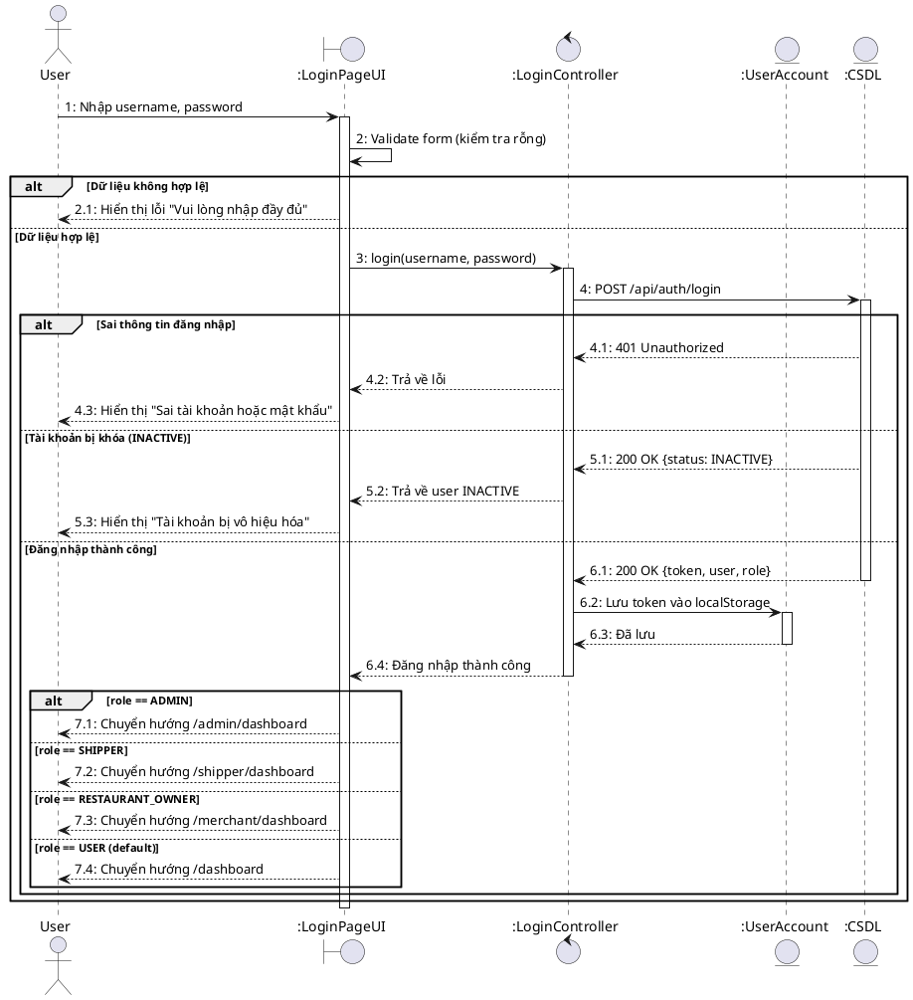

# Sequence Diagram – LoginPage.jsx

## UC-01: Đăng nhập hệ thống

```plantuml
@startuml UC01_DangNhap
actor User
boundary ":LoginPageUI" as UI
control ":LoginController" as CTRL
entity ":UserAccount" as ENT
entity ":CSDL" as DB

User -> UI : 1: Nhập username, password
activate UI

UI -> UI : 2: Validate form (kiểm tra rỗng)

alt Dữ liệu không hợp lệ
    UI --> User : 2.1: Hiển thị lỗi "Vui lòng nhập đầy đủ"
else Dữ liệu hợp lệ
    UI -> CTRL : 3: login(username, password)
    activate CTRL

    CTRL -> DB : 4: POST /api/auth/login
    activate DB

    alt Sai thông tin đăng nhập
        DB --> CTRL : 4.1: 401 Unauthorized
        CTRL --> UI : 4.2: Trả về lỗi
        UI --> User : 4.3: Hiển thị "Sai tài khoản hoặc mật khẩu"
    else Tài khoản bị khóa (INACTIVE)
        DB --> CTRL : 5.1: 200 OK {status: INACTIVE}
        CTRL --> UI : 5.2: Trả về user INACTIVE
        UI --> User : 5.3: Hiển thị "Tài khoản bị vô hiệu hóa"
    else Đăng nhập thành công
        DB --> CTRL : 6.1: 200 OK {token, user, role}
        deactivate DB

        CTRL -> ENT : 6.2: Lưu token vào localStorage
        activate ENT
        ENT --> CTRL : 6.3: Đã lưu
        deactivate ENT

        CTRL --> UI : 6.4: Đăng nhập thành công
        deactivate CTRL

        alt role == ADMIN
            UI --> User : 7.1: Chuyển hướng /admin/dashboard
        else role == SHIPPER
            UI --> User : 7.2: Chuyển hướng /shipper/dashboard
        else role == RESTAURANT_OWNER
            UI --> User : 7.3: Chuyển hướng /merchant/dashboard
        else role == USER (default)
            UI --> User : 7.4: Chuyển hướng /dashboard
        end
    end
end

deactivate UI
@enduml
```
