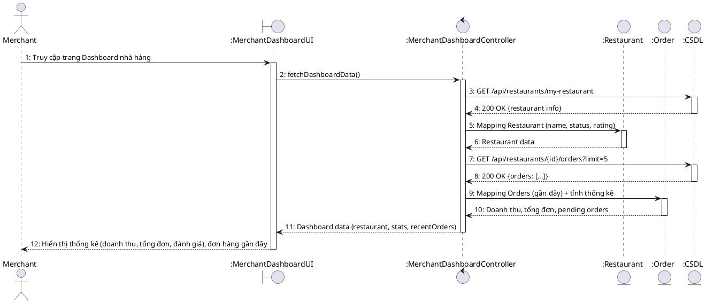
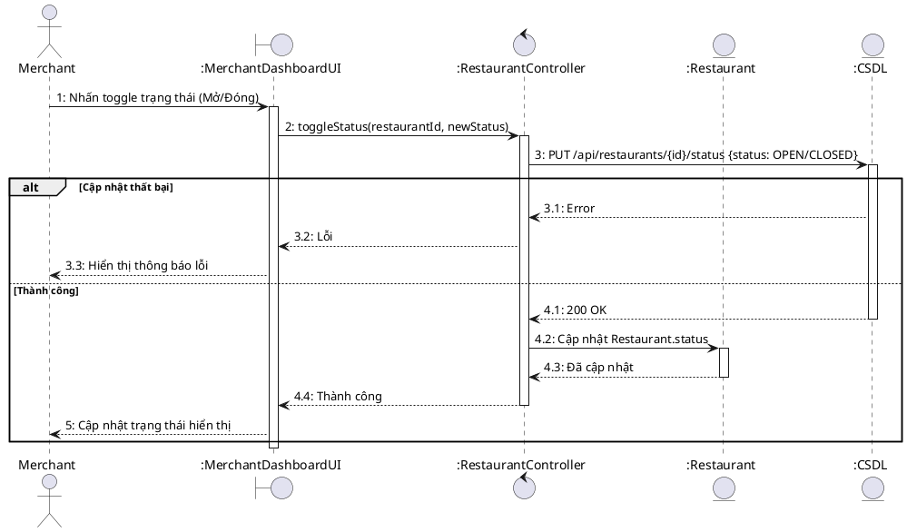

# Sequence Diagram – MerchantDashboardPage.jsx

## UC-30: Xem tổng quan nhà hàng

```plantuml
@startuml UC30_XemTongQuanNhaHang
actor Merchant
boundary ":MerchantDashboardUI" as UI
control ":MerchantDashboardController" as CTRL
entity ":Restaurant" as ENTR
entity ":Order" as ENTO
entity ":CSDL" as DB

Merchant -> UI : 1: Truy cập trang Dashboard nhà hàng
activate UI

UI -> CTRL : 2: fetchDashboardData()
activate CTRL

CTRL -> DB : 3: GET /api/restaurants/my-restaurant
activate DB
DB --> CTRL : 4: 200 OK {restaurant info}
deactivate DB

CTRL -> ENTR : 5: Mapping Restaurant (name, status, rating)
activate ENTR
ENTR --> CTRL : 6: Restaurant data
deactivate ENTR

CTRL -> DB : 7: GET /api/restaurants/{id}/orders?limit=5
activate DB
DB --> CTRL : 8: 200 OK {orders: [...]}
deactivate DB

CTRL -> ENTO : 9: Mapping Orders (gần đây) + tính thống kê
activate ENTO
ENTO --> CTRL : 10: Doanh thu, tổng đơn, pending orders
deactivate ENTO

CTRL --> UI : 11: Dashboard data (restaurant, stats, recentOrders)
deactivate CTRL

UI --> Merchant : 12: Hiển thị thống kê (doanh thu, tổng đơn, đánh giá), đơn hàng gần đây
deactivate UI
@enduml
```

## UC-31: Bật/Tắt trạng thái nhà hàng

```plantuml
@startuml UC31_ToggleTrangThaiNhaHang
actor Merchant
boundary ":MerchantDashboardUI" as UI
control ":RestaurantController" as CTRL
entity ":Restaurant" as ENT
entity ":CSDL" as DB

Merchant -> UI : 1: Nhấn toggle trạng thái (Mở/Đóng)
activate UI

UI -> CTRL : 2: toggleStatus(restaurantId, newStatus)
activate CTRL

CTRL -> DB : 3: PUT /api/restaurants/{id}/status {status: OPEN/CLOSED}
activate DB

alt Cập nhật thất bại
    DB --> CTRL : 3.1: Error
    CTRL --> UI : 3.2: Lỗi
    UI --> Merchant : 3.3: Hiển thị thông báo lỗi
else Thành công
    DB --> CTRL : 4.1: 200 OK
    deactivate DB

    CTRL -> ENT : 4.2: Cập nhật Restaurant.status
    activate ENT
    ENT --> CTRL : 4.3: Đã cập nhật
    deactivate ENT

    CTRL --> UI : 4.4: Thành công
    deactivate CTRL

    UI --> Merchant : 5: Cập nhật trạng thái hiển thị
end

deactivate UI
@enduml
```
