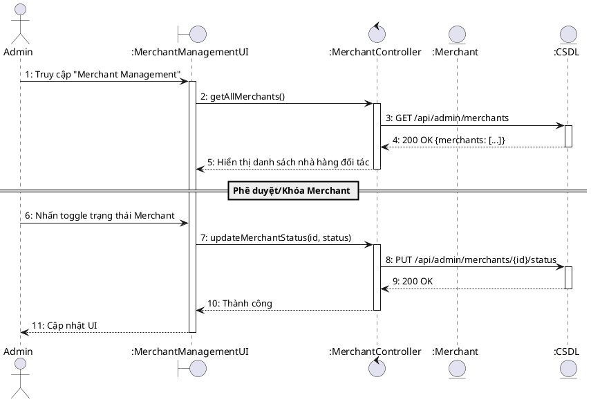

# Sequence Diagram – Merchant Management (Admin)

## UC-76: Quản lý đối tác nhà hàng (Merchants)

```plantuml
@startuml UC76_AdminQuanLyMerchant
actor Admin
boundary ":MerchantManagementUI" as UI
control ":MerchantController" as CTRL
entity ":Merchant" as ENT
entity ":CSDL" as DB

Admin -> UI : 1: Truy cập "Merchant Management"
activate UI

UI -> CTRL : 2: getAllMerchants()
activate CTRL
CTRL -> DB : 3: GET /api/admin/merchants
activate DB
DB --> CTRL : 4: 200 OK {merchants: [...]}
deactivate DB
CTRL --> UI : 5: Hiển thị danh sách nhà hàng đối tác
deactivate CTRL

== Phê duyệt/Khóa Merchant ==
Admin -> UI : 6: Nhấn toggle trạng thái Merchant
UI -> CTRL : 7: updateMerchantStatus(id, status)
activate CTRL
CTRL -> DB : 8: PUT /api/admin/merchants/{id}/status
activate DB
DB --> CTRL : 9: 200 OK
deactivate DB
CTRL --> UI : 10: Thành công
deactivate CTRL
UI --> Admin : 11: Cập nhật UI

deactivate UI
@enduml
```
