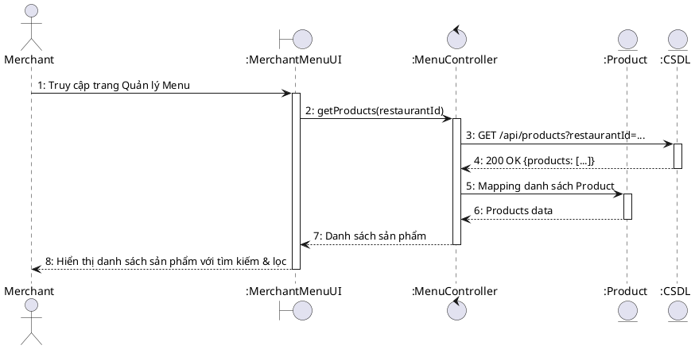
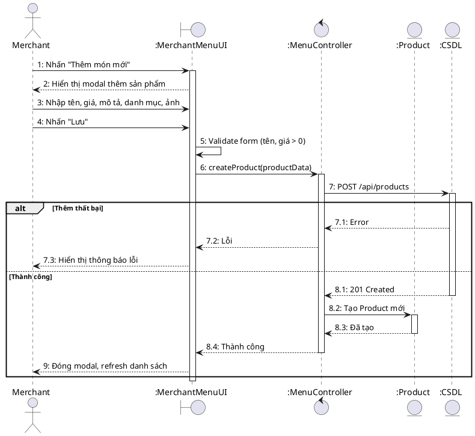
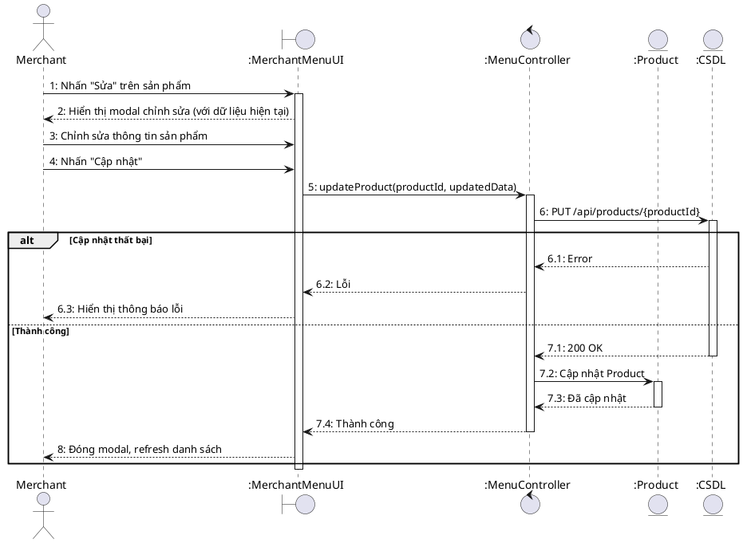
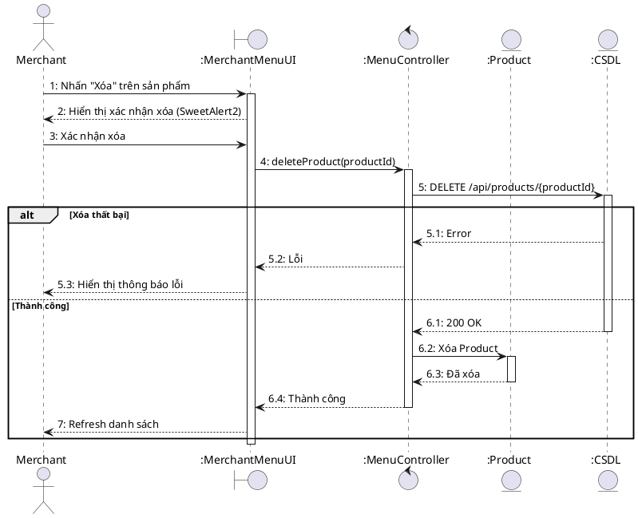
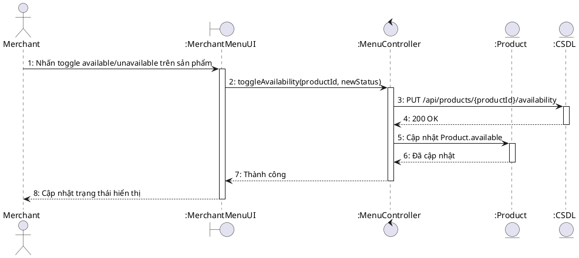

# Sequence Diagram – MerchantMenuPage.jsx

## UC-32: Xem danh sách sản phẩm nhà hàng

## UC-33: Thêm sản phẩm mới

## UC-34: Sửa sản phẩm

## UC-35: Xóa sản phẩm

## UC-36: Bật/Tắt sản phẩm (Toggle availability)

