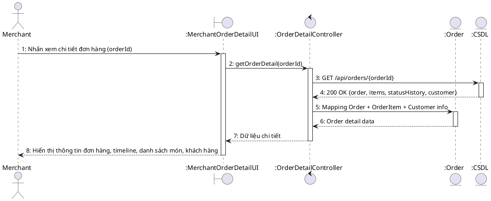
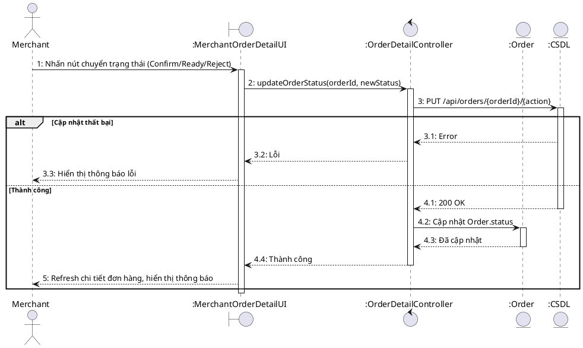

# Sequence Diagram – MerchantOrderDetailPage.jsx

## UC-41: Xem chi tiết đơn hàng (Merchant)

```plantuml
@startuml UC41_XemChiTietDonHangMerchant
actor Merchant
boundary ":MerchantOrderDetailUI" as UI
control ":OrderDetailController" as CTRL
entity ":Order" as ENT
entity ":CSDL" as DB

Merchant -> UI : 1: Nhấn xem chi tiết đơn hàng (orderId)
activate UI

UI -> CTRL : 2: getOrderDetail(orderId)
activate CTRL

CTRL -> DB : 3: GET /api/orders/{orderId}
activate DB
DB --> CTRL : 4: 200 OK {order, items, statusHistory, customer}
deactivate DB

CTRL -> ENT : 5: Mapping Order + OrderItem + Customer info
activate ENT
ENT --> CTRL : 6: Order detail data
deactivate ENT

CTRL --> UI : 7: Dữ liệu chi tiết
deactivate CTRL

UI --> Merchant : 8: Hiển thị thông tin đơn hàng, timeline, danh sách món, khách hàng
deactivate UI
@enduml
```

## UC-42: Chuyển trạng thái đơn hàng (Merchant)

```plantuml
@startuml UC42_ChuyenTrangThaiDonHang
actor Merchant
boundary ":MerchantOrderDetailUI" as UI
control ":OrderDetailController" as CTRL
entity ":Order" as ENT
entity ":CSDL" as DB

Merchant -> UI : 1: Nhấn nút chuyển trạng thái (Confirm/Ready/Reject)
activate UI

UI -> CTRL : 2: updateOrderStatus(orderId, newStatus)
activate CTRL

CTRL -> DB : 3: PUT /api/orders/{orderId}/{action}
activate DB

alt Cập nhật thất bại
    DB --> CTRL : 3.1: Error
    CTRL --> UI : 3.2: Lỗi
    UI --> Merchant : 3.3: Hiển thị thông báo lỗi
else Thành công
    DB --> CTRL : 4.1: 200 OK
    deactivate DB

    CTRL -> ENT : 4.2: Cập nhật Order.status
    activate ENT
    ENT --> CTRL : 4.3: Đã cập nhật
    deactivate ENT

    CTRL --> UI : 4.4: Thành công
    deactivate CTRL

    UI --> Merchant : 5: Refresh chi tiết đơn hàng, hiển thị thông báo
end

deactivate UI
@enduml
```
