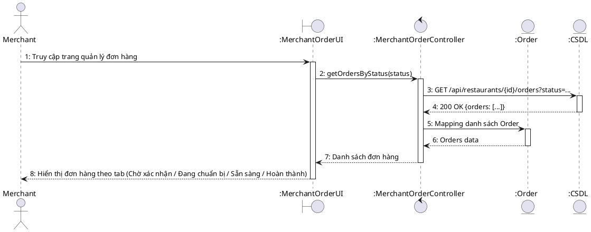
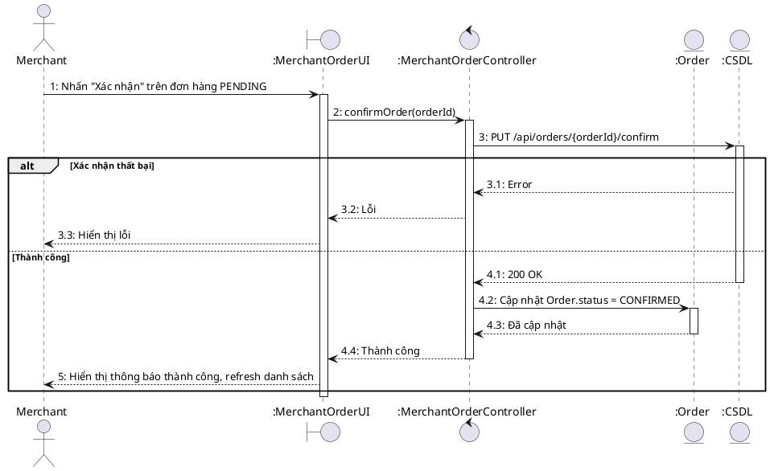
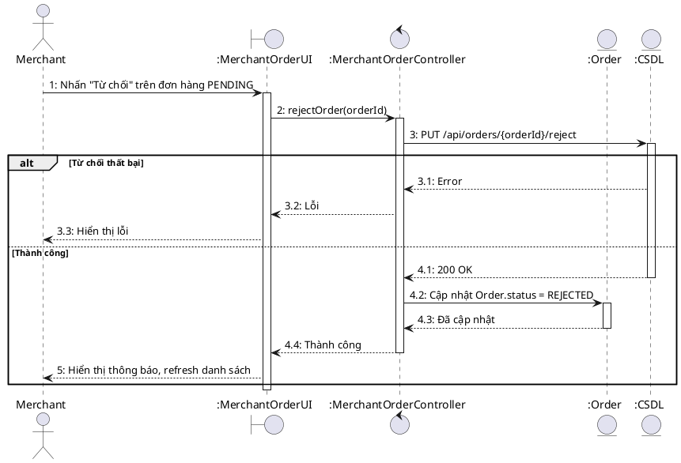
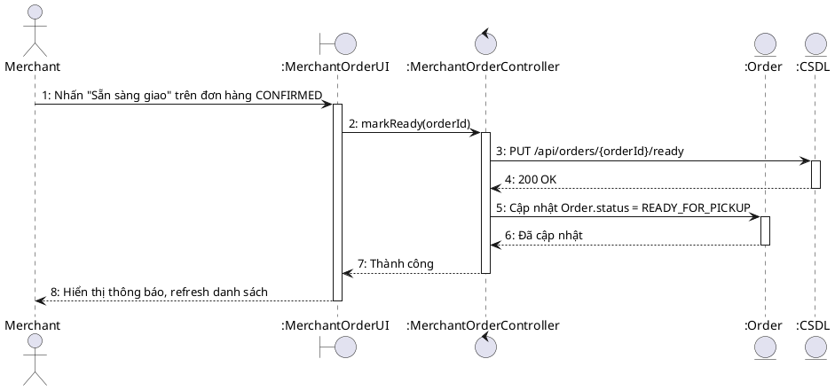

# Sequence Diagram – MerchantOrderPage.jsx

## UC-37: Xem danh sách đơn hàng (Merchant)

```plantuml
@startuml UC37_XemDonHangMerchant
actor Merchant
boundary ":MerchantOrderUI" as UI
control ":MerchantOrderController" as CTRL
entity ":Order" as ENT
entity ":CSDL" as DB

Merchant -> UI : 1: Truy cập trang quản lý đơn hàng
activate UI

UI -> CTRL : 2: getOrdersByStatus(status)
activate CTRL

CTRL -> DB : 3: GET /api/restaurants/{id}/orders?status=...
activate DB
DB --> CTRL : 4: 200 OK {orders: [...]}
deactivate DB

CTRL -> ENT : 5: Mapping danh sách Order
activate ENT
ENT --> CTRL : 6: Orders data
deactivate ENT

CTRL --> UI : 7: Danh sách đơn hàng
deactivate CTRL

UI --> Merchant : 8: Hiển thị đơn hàng theo tab (Chờ xác nhận / Đang chuẩn bị / Sẵn sàng / Hoàn thành)
deactivate UI
@enduml
```

## UC-38: Xác nhận đơn hàng

```plantuml
@startuml UC38_XacNhanDonHang
actor Merchant
boundary ":MerchantOrderUI" as UI
control ":MerchantOrderController" as CTRL
entity ":Order" as ENT
entity ":CSDL" as DB

Merchant -> UI : 1: Nhấn "Xác nhận" trên đơn hàng PENDING
activate UI

UI -> CTRL : 2: confirmOrder(orderId)
activate CTRL

CTRL -> DB : 3: PUT /api/orders/{orderId}/confirm
activate DB

alt Xác nhận thất bại
    DB --> CTRL : 3.1: Error
    CTRL --> UI : 3.2: Lỗi
    UI --> Merchant : 3.3: Hiển thị lỗi
else Thành công
    DB --> CTRL : 4.1: 200 OK
    deactivate DB

    CTRL -> ENT : 4.2: Cập nhật Order.status = CONFIRMED
    activate ENT
    ENT --> CTRL : 4.3: Đã cập nhật
    deactivate ENT

    CTRL --> UI : 4.4: Thành công
    deactivate CTRL

    UI --> Merchant : 5: Hiển thị thông báo thành công, refresh danh sách
end

deactivate UI
@enduml
```

## UC-39: Từ chối đơn hàng

```plantuml
@startuml UC39_TuChoiDonHang
actor Merchant
boundary ":MerchantOrderUI" as UI
control ":MerchantOrderController" as CTRL
entity ":Order" as ENT
entity ":CSDL" as DB

Merchant -> UI : 1: Nhấn "Từ chối" trên đơn hàng PENDING
activate UI

UI -> CTRL : 2: rejectOrder(orderId)
activate CTRL

CTRL -> DB : 3: PUT /api/orders/{orderId}/reject
activate DB

alt Từ chối thất bại
    DB --> CTRL : 3.1: Error
    CTRL --> UI : 3.2: Lỗi
    UI --> Merchant : 3.3: Hiển thị lỗi
else Thành công
    DB --> CTRL : 4.1: 200 OK
    deactivate DB

    CTRL -> ENT : 4.2: Cập nhật Order.status = REJECTED
    activate ENT
    ENT --> CTRL : 4.3: Đã cập nhật
    deactivate ENT

    CTRL --> UI : 4.4: Thành công
    deactivate CTRL

    UI --> Merchant : 5: Hiển thị thông báo, refresh danh sách
end

deactivate UI
@enduml
```

## UC-40: Đánh dấu đơn hàng sẵn sàng

```plantuml
@startuml UC40_SanSangGiaoHang
actor Merchant
boundary ":MerchantOrderUI" as UI
control ":MerchantOrderController" as CTRL
entity ":Order" as ENT
entity ":CSDL" as DB

Merchant -> UI : 1: Nhấn "Sẵn sàng giao" trên đơn hàng CONFIRMED
activate UI

UI -> CTRL : 2: markReady(orderId)
activate CTRL

CTRL -> DB : 3: PUT /api/orders/{orderId}/ready
activate DB

DB --> CTRL : 4: 200 OK
deactivate DB

CTRL -> ENT : 5: Cập nhật Order.status = READY_FOR_PICKUP
activate ENT
ENT --> CTRL : 6: Đã cập nhật
deactivate ENT

CTRL --> UI : 7: Thành công
deactivate CTRL

UI --> Merchant : 8: Hiển thị thông báo, refresh danh sách
deactivate UI
@enduml
```
