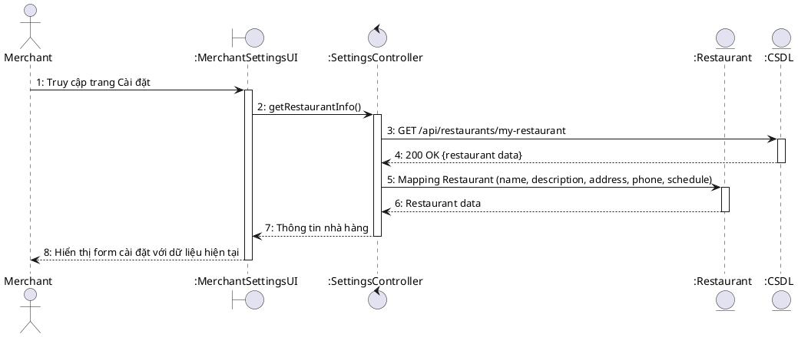
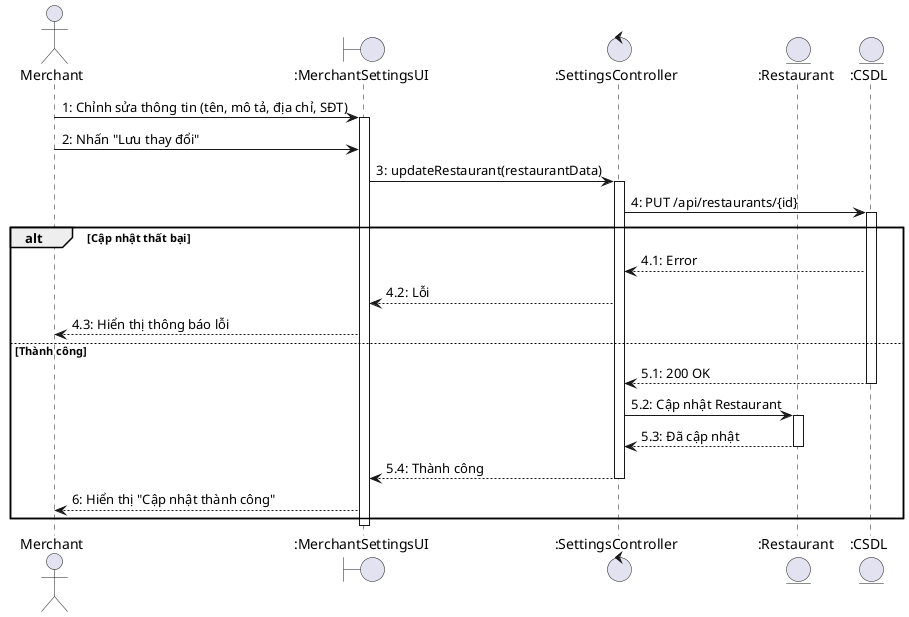
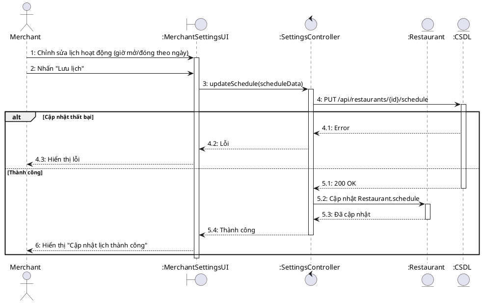

# Sequence Diagram – MerchantSettingsPage.jsx

## UC-43: Xem cài đặt nhà hàng

```plantuml
@startuml UC43_XemCaiDatNhaHang
actor Merchant
boundary ":MerchantSettingsUI" as UI
control ":SettingsController" as CTRL
entity ":Restaurant" as ENT
entity ":CSDL" as DB

Merchant -> UI : 1: Truy cập trang Cài đặt
activate UI

UI -> CTRL : 2: getRestaurantInfo()
activate CTRL

CTRL -> DB : 3: GET /api/restaurants/my-restaurant
activate DB
DB --> CTRL : 4: 200 OK {restaurant data}
deactivate DB

CTRL -> ENT : 5: Mapping Restaurant (name, description, address, phone, schedule)
activate ENT
ENT --> CTRL : 6: Restaurant data
deactivate ENT

CTRL --> UI : 7: Thông tin nhà hàng
deactivate CTRL

UI --> Merchant : 8: Hiển thị form cài đặt với dữ liệu hiện tại
deactivate UI
@enduml
```

## UC-44: Cập nhật thông tin nhà hàng

```plantuml
@startuml UC44_CapNhatThongTinNhaHang
actor Merchant
boundary ":MerchantSettingsUI" as UI
control ":SettingsController" as CTRL
entity ":Restaurant" as ENT
entity ":CSDL" as DB

Merchant -> UI : 1: Chỉnh sửa thông tin (tên, mô tả, địa chỉ, SĐT)
activate UI

Merchant -> UI : 2: Nhấn "Lưu thay đổi"

UI -> CTRL : 3: updateRestaurant(restaurantData)
activate CTRL

CTRL -> DB : 4: PUT /api/restaurants/{id}
activate DB

alt Cập nhật thất bại
    DB --> CTRL : 4.1: Error
    CTRL --> UI : 4.2: Lỗi
    UI --> Merchant : 4.3: Hiển thị thông báo lỗi
else Thành công
    DB --> CTRL : 5.1: 200 OK
    deactivate DB

    CTRL -> ENT : 5.2: Cập nhật Restaurant
    activate ENT
    ENT --> CTRL : 5.3: Đã cập nhật
    deactivate ENT

    CTRL --> UI : 5.4: Thành công
    deactivate CTRL

    UI --> Merchant : 6: Hiển thị "Cập nhật thành công"
end

deactivate UI
@enduml
```

## UC-45: Cập nhật lịch hoạt động

```plantuml
@startuml UC45_CapNhatLichHoatDong
actor Merchant
boundary ":MerchantSettingsUI" as UI
control ":SettingsController" as CTRL
entity ":Restaurant" as ENT
entity ":CSDL" as DB

Merchant -> UI : 1: Chỉnh sửa lịch hoạt động (giờ mở/đóng theo ngày)
activate UI

Merchant -> UI : 2: Nhấn "Lưu lịch"

UI -> CTRL : 3: updateSchedule(scheduleData)
activate CTRL

CTRL -> DB : 4: PUT /api/restaurants/{id}/schedule
activate DB

alt Cập nhật thất bại
    DB --> CTRL : 4.1: Error
    CTRL --> UI : 4.2: Lỗi
    UI --> Merchant : 4.3: Hiển thị lỗi
else Thành công
    DB --> CTRL : 5.1: 200 OK
    deactivate DB

    CTRL -> ENT : 5.2: Cập nhật Restaurant.schedule
    activate ENT
    ENT --> CTRL : 5.3: Đã cập nhật
    deactivate ENT

    CTRL --> UI : 5.4: Thành công
    deactivate CTRL

    UI --> Merchant : 6: Hiển thị "Cập nhật lịch thành công"
end

deactivate UI
@enduml
```
