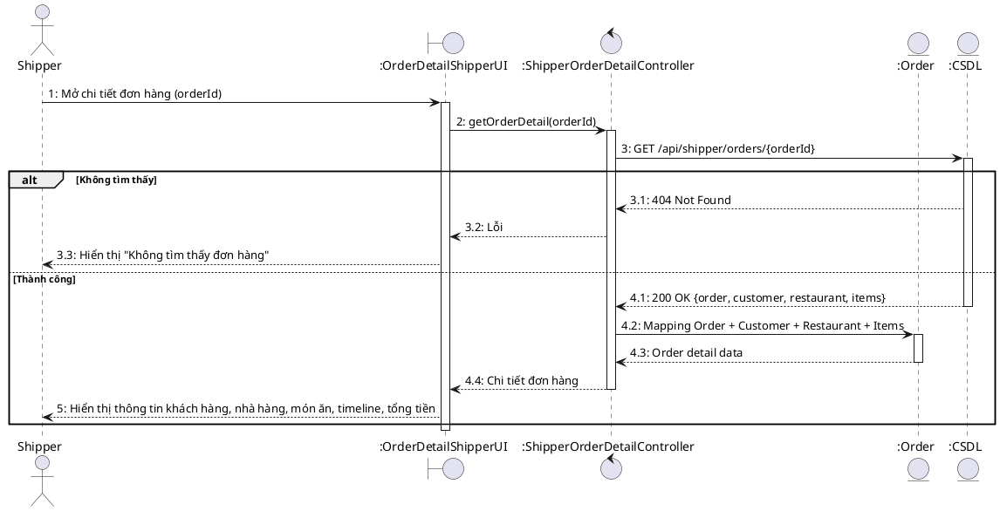
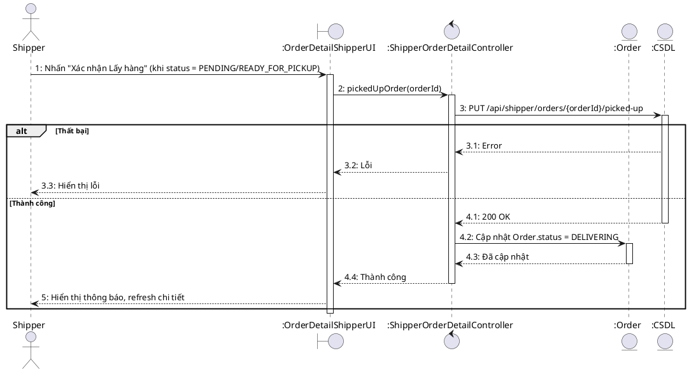
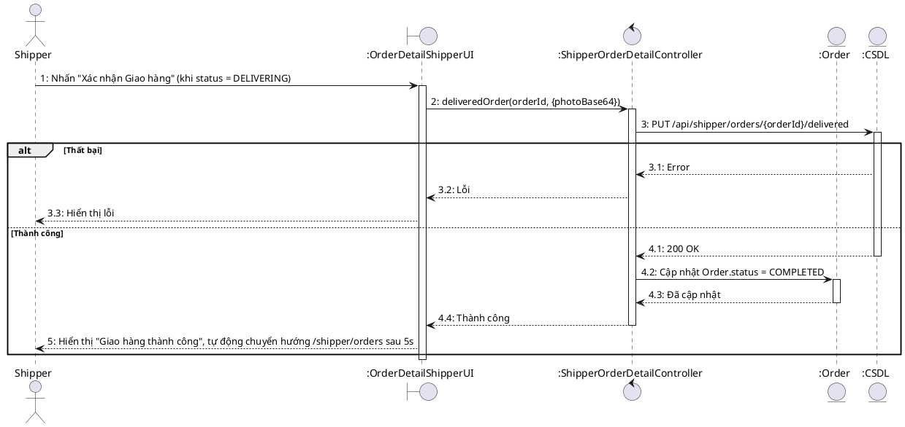
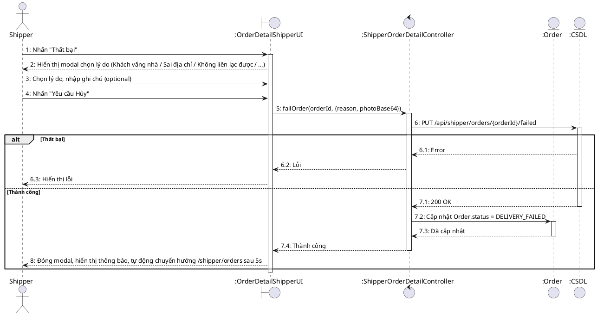

# Sequence Diagram – OrderDetailShipperPage.jsx

## UC-51: Xem chi tiết đơn hàng (Shipper)

## UC-52: Xác nhận lấy hàng (từ Detail)

## UC-53: Xác nhận giao hàng thành công

## UC-54: Báo cáo giao hàng thất bại

