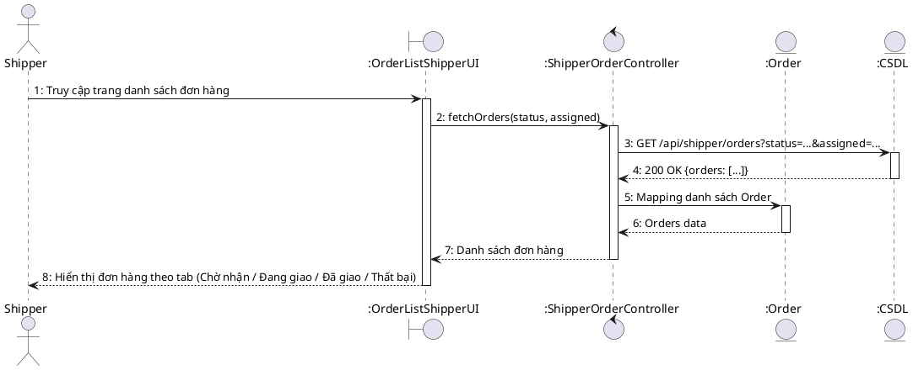
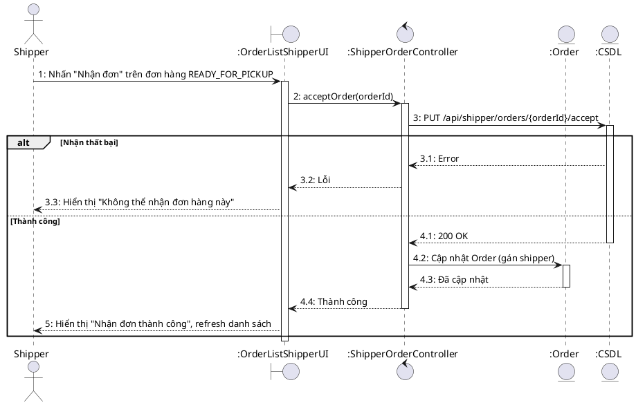
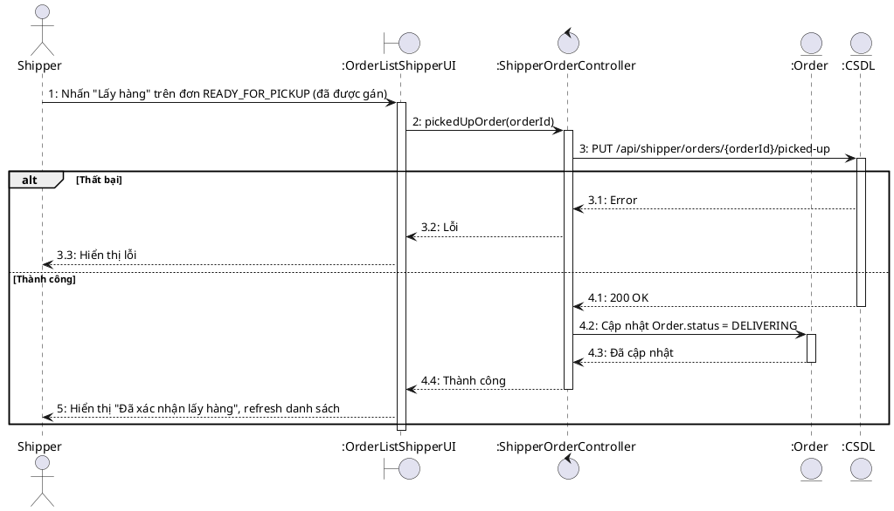

# Sequence Diagram – OrderListShipperPage.jsx

## UC-48: Xem danh sách đơn hàng (Shipper)

```plantuml
@startuml UC48_XemDonHangShipper
actor Shipper
boundary ":OrderListShipperUI" as UI
control ":ShipperOrderController" as CTRL
entity ":Order" as ENT
entity ":CSDL" as DB

Shipper -> UI : 1: Truy cập trang danh sách đơn hàng
activate UI

UI -> CTRL : 2: fetchOrders(status, assigned)
activate CTRL

CTRL -> DB : 3: GET /api/shipper/orders?status=...&assigned=...
activate DB
DB --> CTRL : 4: 200 OK {orders: [...]}
deactivate DB

CTRL -> ENT : 5: Mapping danh sách Order
activate ENT
ENT --> CTRL : 6: Orders data
deactivate ENT

CTRL --> UI : 7: Danh sách đơn hàng
deactivate CTRL

UI --> Shipper : 8: Hiển thị đơn hàng theo tab (Chờ nhận / Đang giao / Đã giao / Thất bại)
deactivate UI
@enduml
```

## UC-49: Nhận đơn hàng (Accept Order)

```plantuml
@startuml UC49_NhanDonHang
actor Shipper
boundary ":OrderListShipperUI" as UI
control ":ShipperOrderController" as CTRL
entity ":Order" as ENT
entity ":CSDL" as DB

Shipper -> UI : 1: Nhấn "Nhận đơn" trên đơn hàng READY_FOR_PICKUP
activate UI

UI -> CTRL : 2: acceptOrder(orderId)
activate CTRL

CTRL -> DB : 3: PUT /api/shipper/orders/{orderId}/accept
activate DB

alt Nhận thất bại
    DB --> CTRL : 3.1: Error
    CTRL --> UI : 3.2: Lỗi
    UI --> Shipper : 3.3: Hiển thị "Không thể nhận đơn hàng này"
else Thành công
    DB --> CTRL : 4.1: 200 OK
    deactivate DB

    CTRL -> ENT : 4.2: Cập nhật Order (gán shipper)
    activate ENT
    ENT --> CTRL : 4.3: Đã cập nhật
    deactivate ENT

    CTRL --> UI : 4.4: Thành công
    deactivate CTRL

    UI --> Shipper : 5: Hiển thị "Nhận đơn thành công", refresh danh sách
end

deactivate UI
@enduml
```

## UC-50: Xác nhận lấy hàng (Picked Up)

```plantuml
@startuml UC50_XacNhanLayHang
actor Shipper
boundary ":OrderListShipperUI" as UI
control ":ShipperOrderController" as CTRL
entity ":Order" as ENT
entity ":CSDL" as DB

Shipper -> UI : 1: Nhấn "Lấy hàng" trên đơn READY_FOR_PICKUP (đã được gán)
activate UI

UI -> CTRL : 2: pickedUpOrder(orderId)
activate CTRL

CTRL -> DB : 3: PUT /api/shipper/orders/{orderId}/picked-up
activate DB

alt Thất bại
    DB --> CTRL : 3.1: Error
    CTRL --> UI : 3.2: Lỗi
    UI --> Shipper : 3.3: Hiển thị lỗi
else Thành công
    DB --> CTRL : 4.1: 200 OK
    deactivate DB

    CTRL -> ENT : 4.2: Cập nhật Order.status = DELIVERING
    activate ENT
    ENT --> CTRL : 4.3: Đã cập nhật
    deactivate ENT

    CTRL --> UI : 4.4: Thành công
    deactivate CTRL

    UI --> Shipper : 5: Hiển thị "Đã xác nhận lấy hàng", refresh danh sách
end

deactivate UI
@enduml
```
