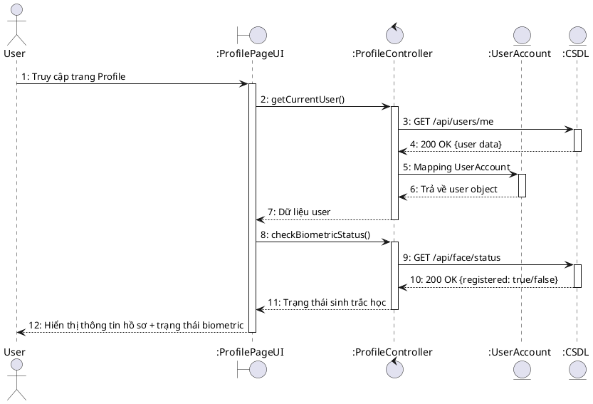
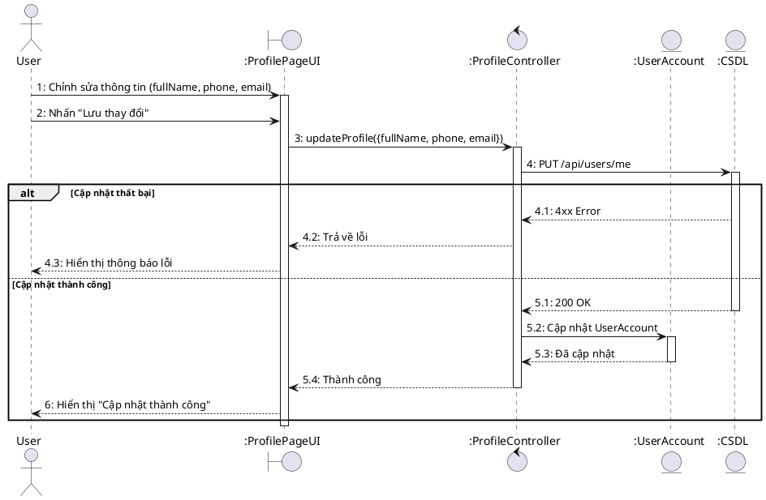
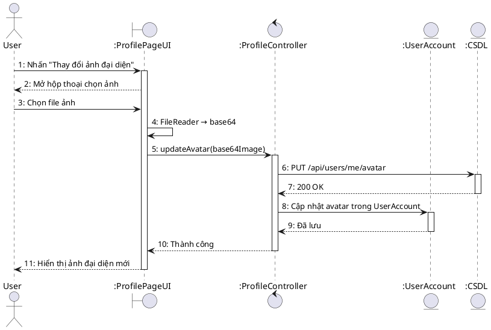

# Sequence Diagram – ProfilePage.jsx

## UC-08: Xem thông tin hồ sơ cá nhân

```plantuml
@startuml UC08_XemHoSo
actor User
boundary ":ProfilePageUI" as UI
control ":ProfileController" as CTRL
entity ":UserAccount" as ENT
entity ":CSDL" as DB

User -> UI : 1: Truy cập trang Profile
activate UI

UI -> CTRL : 2: getCurrentUser()
activate CTRL

CTRL -> DB : 3: GET /api/users/me
activate DB
DB --> CTRL : 4: 200 OK {user data}
deactivate DB

CTRL -> ENT : 5: Mapping UserAccount
activate ENT
ENT --> CTRL : 6: Trả về user object
deactivate ENT

CTRL --> UI : 7: Dữ liệu user
deactivate CTRL

UI -> CTRL : 8: checkBiometricStatus()
activate CTRL
CTRL -> DB : 9: GET /api/face/status
activate DB
DB --> CTRL : 10: 200 OK {registered: true/false}
deactivate DB
CTRL --> UI : 11: Trạng thái sinh trắc học
deactivate CTRL

UI --> User : 12: Hiển thị thông tin hồ sơ + trạng thái biometric
deactivate UI
@enduml
```

## UC-09: Cập nhật hồ sơ cá nhân

```plantuml
@startuml UC09_CapNhatHoSo
actor User
boundary ":ProfilePageUI" as UI
control ":ProfileController" as CTRL
entity ":UserAccount" as ENT
entity ":CSDL" as DB

User -> UI : 1: Chỉnh sửa thông tin (fullName, phone, email)
activate UI

User -> UI : 2: Nhấn "Lưu thay đổi"

UI -> CTRL : 3: updateProfile({fullName, phone, email})
activate CTRL

CTRL -> DB : 4: PUT /api/users/me
activate DB

alt Cập nhật thất bại
    DB --> CTRL : 4.1: 4xx Error
    CTRL --> UI : 4.2: Trả về lỗi
    UI --> User : 4.3: Hiển thị thông báo lỗi
else Cập nhật thành công
    DB --> CTRL : 5.1: 200 OK
    deactivate DB
    CTRL -> ENT : 5.2: Cập nhật UserAccount
    activate ENT
    ENT --> CTRL : 5.3: Đã cập nhật
    deactivate ENT
    CTRL --> UI : 5.4: Thành công
    deactivate CTRL
    UI --> User : 6: Hiển thị "Cập nhật thành công"
end

deactivate UI
@enduml
```

## UC-10: Cập nhật ảnh đại diện

```plantuml
@startuml UC10_CapNhatAvatar
actor User
boundary ":ProfilePageUI" as UI
control ":ProfileController" as CTRL
entity ":UserAccount" as ENT
entity ":CSDL" as DB

User -> UI : 1: Nhấn "Thay đổi ảnh đại diện"
activate UI

UI --> User : 2: Mở hộp thoại chọn ảnh
User -> UI : 3: Chọn file ảnh

UI -> UI : 4: FileReader → base64
UI -> CTRL : 5: updateAvatar(base64Image)
activate CTRL

CTRL -> DB : 6: PUT /api/users/me/avatar
activate DB
DB --> CTRL : 7: 200 OK
deactivate DB

CTRL -> ENT : 8: Cập nhật avatar trong UserAccount
activate ENT
ENT --> CTRL : 9: Đã lưu
deactivate ENT

CTRL --> UI : 10: Thành công
deactivate CTRL

UI --> User : 11: Hiển thị ảnh đại diện mới
deactivate UI
@enduml
```
