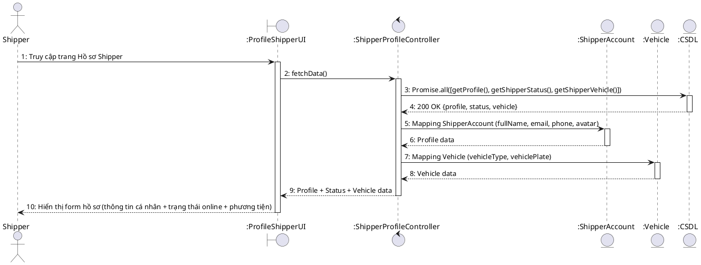
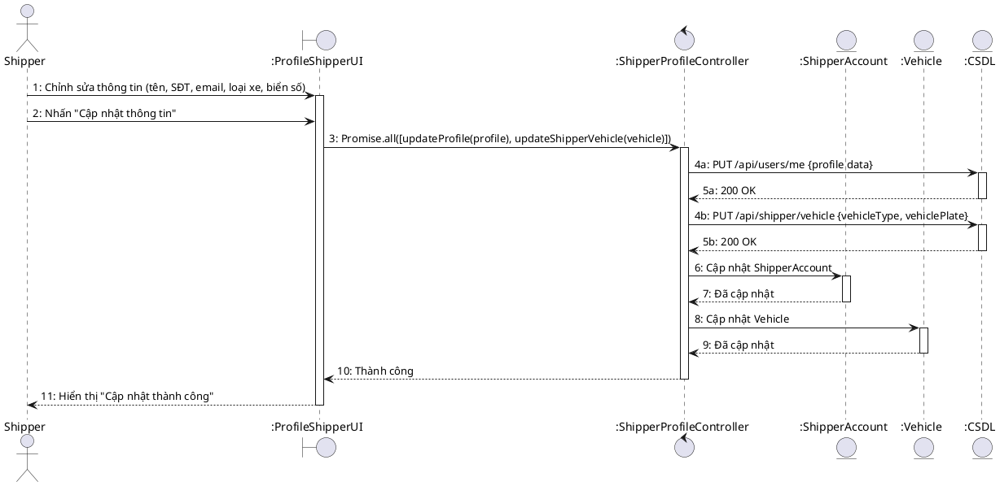
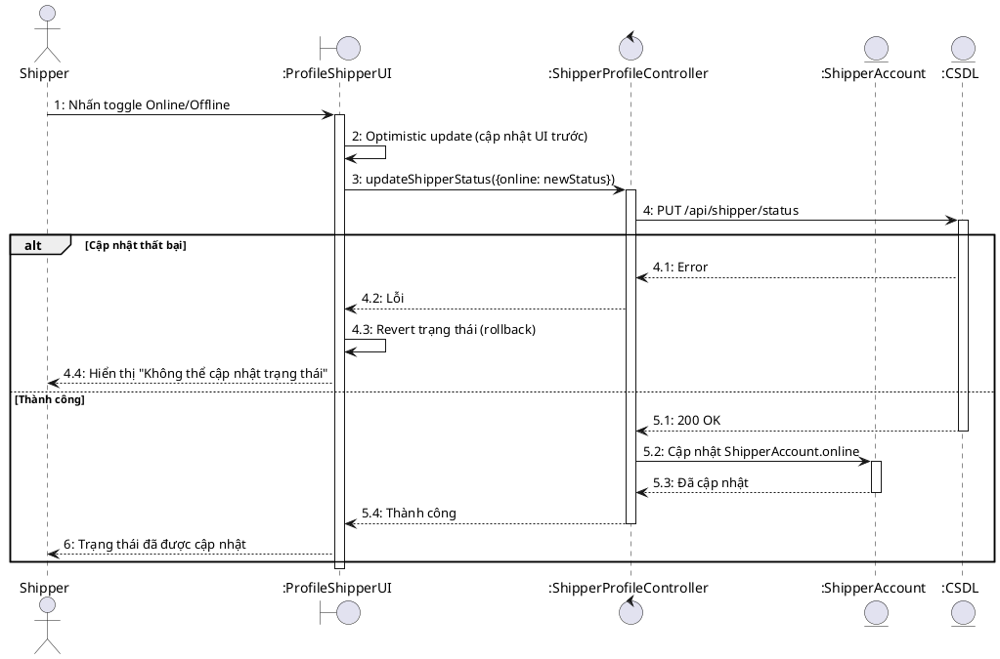
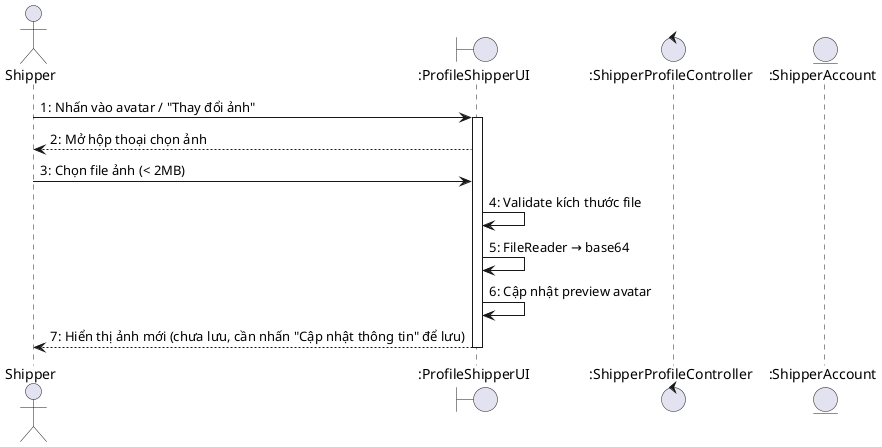

# Sequence Diagram – ProfileShipperPage.jsx

## UC-55: Xem hồ sơ Shipper

```plantuml
@startuml UC55_XemHoSoShipper
actor Shipper
boundary ":ProfileShipperUI" as UI
control ":ShipperProfileController" as CTRL
entity ":ShipperAccount" as ENTS
entity ":Vehicle" as ENTV
entity ":CSDL" as DB

Shipper -> UI : 1: Truy cập trang Hồ sơ Shipper
activate UI

UI -> CTRL : 2: fetchData()
activate CTRL

CTRL -> DB : 3: Promise.all([getProfile(), getShipperStatus(), getShipperVehicle()])
activate DB
DB --> CTRL : 4: 200 OK {profile, status, vehicle}
deactivate DB

CTRL -> ENTS : 5: Mapping ShipperAccount (fullName, email, phone, avatar)
activate ENTS
ENTS --> CTRL : 6: Profile data
deactivate ENTS

CTRL -> ENTV : 7: Mapping Vehicle (vehicleType, vehiclePlate)
activate ENTV
ENTV --> CTRL : 8: Vehicle data
deactivate ENTV

CTRL --> UI : 9: Profile + Status + Vehicle data
deactivate CTRL

UI --> Shipper : 10: Hiển thị form hồ sơ (thông tin cá nhân + trạng thái online + phương tiện)
deactivate UI
@enduml
```

## UC-56: Cập nhật hồ sơ và phương tiện

```plantuml
@startuml UC56_CapNhatHoSoShipper
actor Shipper
boundary ":ProfileShipperUI" as UI
control ":ShipperProfileController" as CTRL
entity ":ShipperAccount" as ENTS
entity ":Vehicle" as ENTV
entity ":CSDL" as DB

Shipper -> UI : 1: Chỉnh sửa thông tin (tên, SĐT, email, loại xe, biển số)
activate UI

Shipper -> UI : 2: Nhấn "Cập nhật thông tin"

UI -> CTRL : 3: Promise.all([updateProfile(profile), updateShipperVehicle(vehicle)])
activate CTRL

CTRL -> DB : 4a: PUT /api/users/me {profile data}
activate DB
DB --> CTRL : 5a: 200 OK
deactivate DB

CTRL -> DB : 4b: PUT /api/shipper/vehicle {vehicleType, vehiclePlate}
activate DB
DB --> CTRL : 5b: 200 OK
deactivate DB

CTRL -> ENTS : 6: Cập nhật ShipperAccount
activate ENTS
ENTS --> CTRL : 7: Đã cập nhật
deactivate ENTS

CTRL -> ENTV : 8: Cập nhật Vehicle
activate ENTV
ENTV --> CTRL : 9: Đã cập nhật
deactivate ENTV

CTRL --> UI : 10: Thành công
deactivate CTRL

UI --> Shipper : 11: Hiển thị "Cập nhật thành công"
deactivate UI
@enduml
```

## UC-57: Bật/Tắt trạng thái hoạt động

```plantuml
@startuml UC57_ToggleTrangThaiShipper
actor Shipper
boundary ":ProfileShipperUI" as UI
control ":ShipperProfileController" as CTRL
entity ":ShipperAccount" as ENT
entity ":CSDL" as DB

Shipper -> UI : 1: Nhấn toggle Online/Offline
activate UI

UI -> UI : 2: Optimistic update (cập nhật UI trước)

UI -> CTRL : 3: updateShipperStatus({online: newStatus})
activate CTRL

CTRL -> DB : 4: PUT /api/shipper/status
activate DB

alt Cập nhật thất bại
    DB --> CTRL : 4.1: Error
    CTRL --> UI : 4.2: Lỗi
    UI -> UI : 4.3: Revert trạng thái (rollback)
    UI --> Shipper : 4.4: Hiển thị "Không thể cập nhật trạng thái"
else Thành công
    DB --> CTRL : 5.1: 200 OK
    deactivate DB

    CTRL -> ENT : 5.2: Cập nhật ShipperAccount.online
    activate ENT
    ENT --> CTRL : 5.3: Đã cập nhật
    deactivate ENT

    CTRL --> UI : 5.4: Thành công
    deactivate CTRL

    UI --> Shipper : 6: Trạng thái đã được cập nhật
end

deactivate UI
@enduml
```

## UC-58: Đổi ảnh đại diện (Shipper)

```plantuml
@startuml UC58_DoiAvatarShipper
actor Shipper
boundary ":ProfileShipperUI" as UI
control ":ShipperProfileController" as CTRL
entity ":ShipperAccount" as ENT

Shipper -> UI : 1: Nhấn vào avatar / "Thay đổi ảnh"
activate UI

UI --> Shipper : 2: Mở hộp thoại chọn ảnh

Shipper -> UI : 3: Chọn file ảnh (< 2MB)

UI -> UI : 4: Validate kích thước file
UI -> UI : 5: FileReader → base64
UI -> UI : 6: Cập nhật preview avatar

UI --> Shipper : 7: Hiển thị ảnh mới (chưa lưu, cần nhấn "Cập nhật thông tin" để lưu)
deactivate UI
@enduml
```
