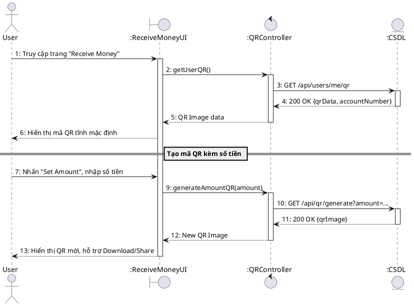

# Sequence Diagram – Receive Money

## UC-67: Nhận tiền qua mã QR

```plantuml
@startuml UC67_NhanTienQR
actor User
boundary ":ReceiveMoneyUI" as UI
control ":QRController" as CTRL
entity ":CSDL" as DB

User -> UI : 1: Truy cập trang "Receive Money"
activate UI

UI -> CTRL : 2: getUserQR()
activate CTRL
CTRL -> DB : 3: GET /api/users/me/qr
activate DB
DB --> CTRL : 4: 200 OK {qrData, accountNumber}
deactivate DB
CTRL --> UI : 5: QR Image data
deactivate CTRL

UI --> User : 6: Hiển thị mã QR tĩnh mặc định

== Tạo mã QR kèm số tiền ==
User -> UI : 7: Nhấn "Set Amount", nhập số tiền
UI -> CTRL : 9: generateAmountQR(amount)
activate CTRL
CTRL -> DB : 10: GET /api/qr/generate?amount=...
activate DB
DB --> CTRL : 11: 200 OK {qrImage}
deactivate DB
CTRL --> UI : 12: New QR Image
deactivate CTRL

UI --> User : 13: Hiển thị QR mới, hỗ trợ Download/Share
deactivate UI
@enduml
```
