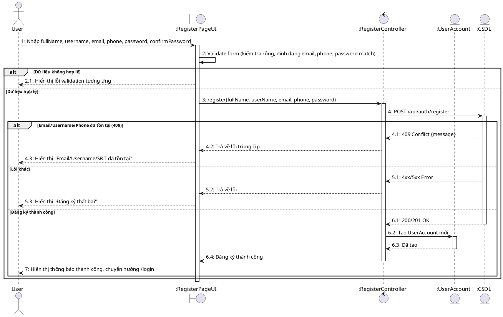

# Sequence Diagram – RegisterPage.jsx

## UC-02: Đăng ký tài khoản

```plantuml
@startuml UC02_DangKy
actor User
boundary ":RegisterPageUI" as UI
control ":RegisterController" as CTRL
entity ":UserAccount" as ENT
entity ":CSDL" as DB

User -> UI : 1: Nhập fullName, username, email, phone, password, confirmPassword
activate UI

UI -> UI : 2: Validate form (kiểm tra rỗng, định dạng email, phone, password match)

alt Dữ liệu không hợp lệ
    UI --> User : 2.1: Hiển thị lỗi validation tương ứng
else Dữ liệu hợp lệ
    UI -> CTRL : 3: register(fullName, userName, email, phone, password)
    activate CTRL

    CTRL -> DB : 4: POST /api/auth/register
    activate DB

    alt Email/Username/Phone đã tồn tại (409)
        DB --> CTRL : 4.1: 409 Conflict {message}
        CTRL --> UI : 4.2: Trả về lỗi trùng lặp
        UI --> User : 4.3: Hiển thị "Email/Username/SĐT đã tồn tại"
    else Lỗi khác
        DB --> CTRL : 5.1: 4xx/5xx Error
        CTRL --> UI : 5.2: Trả về lỗi
        UI --> User : 5.3: Hiển thị "Đăng ký thất bại"
    else Đăng ký thành công
        DB --> CTRL : 6.1: 200/201 OK
        deactivate DB

        CTRL -> ENT : 6.2: Tạo UserAccount mới
        activate ENT
        ENT --> CTRL : 6.3: Đã tạo
        deactivate ENT

        CTRL --> UI : 6.4: Đăng ký thành công
        deactivate CTRL

        UI --> User : 7: Hiển thị thông báo thành công, chuyển hướng /login
    end
end

deactivate UI
@enduml
```
