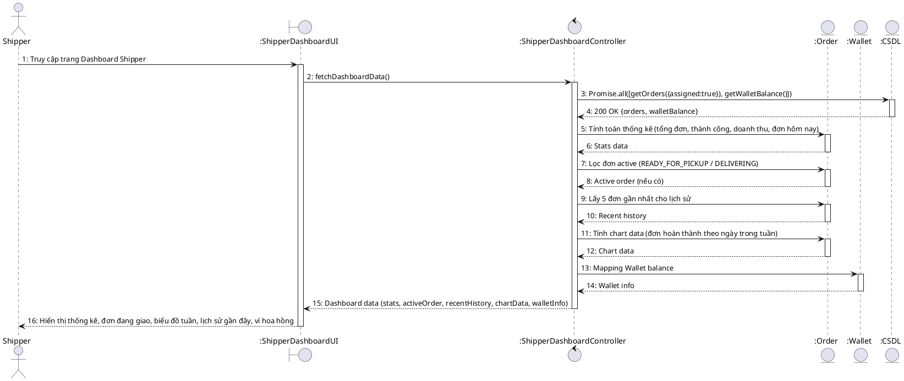
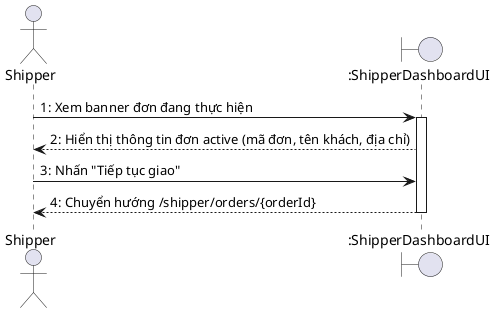

# Sequence Diagram – ShipperDashboardPage.jsx

## UC-46: Xem tổng quan shipper

```plantuml
@startuml UC46_XemTongQuanShipper
actor Shipper
boundary ":ShipperDashboardUI" as UI
control ":ShipperDashboardController" as CTRL
entity ":Order" as ENTO
entity ":Wallet" as ENTW
entity ":CSDL" as DB

Shipper -> UI : 1: Truy cập trang Dashboard Shipper
activate UI

UI -> CTRL : 2: fetchDashboardData()
activate CTRL

CTRL -> DB : 3: Promise.all([getOrders({assigned:true}), getWalletBalance()])
activate DB
DB --> CTRL : 4: 200 OK {orders, walletBalance}
deactivate DB

CTRL -> ENTO : 5: Tính toán thống kê (tổng đơn, thành công, doanh thu, đơn hôm nay)
activate ENTO
ENTO --> CTRL : 6: Stats data
deactivate ENTO

CTRL -> ENTO : 7: Lọc đơn active (READY_FOR_PICKUP / DELIVERING)
activate ENTO
ENTO --> CTRL : 8: Active order (nếu có)
deactivate ENTO

CTRL -> ENTO : 9: Lấy 5 đơn gần nhất cho lịch sử
activate ENTO
ENTO --> CTRL : 10: Recent history
deactivate ENTO

CTRL -> ENTO : 11: Tính chart data (đơn hoàn thành theo ngày trong tuần)
activate ENTO
ENTO --> CTRL : 12: Chart data
deactivate ENTO

CTRL -> ENTW : 13: Mapping Wallet balance
activate ENTW
ENTW --> CTRL : 14: Wallet info
deactivate ENTW

CTRL --> UI : 15: Dashboard data (stats, activeOrder, recentHistory, chartData, walletInfo)
deactivate CTRL

UI --> Shipper : 16: Hiển thị thống kê, đơn đang giao, biểu đồ tuần, lịch sử gần đây, ví hoa hồng
deactivate UI
@enduml
```

## UC-47: Xem đơn đang thực hiện

```plantuml
@startuml UC47_XemDonDangThucHien
actor Shipper
boundary ":ShipperDashboardUI" as UI

Shipper -> UI : 1: Xem banner đơn đang thực hiện
activate UI

UI --> Shipper : 2: Hiển thị thông tin đơn active (mã đơn, tên khách, địa chỉ)

Shipper -> UI : 3: Nhấn "Tiếp tục giao"
UI --> Shipper : 4: Chuyển hướng /shipper/orders/{orderId}
deactivate UI
@enduml
```
