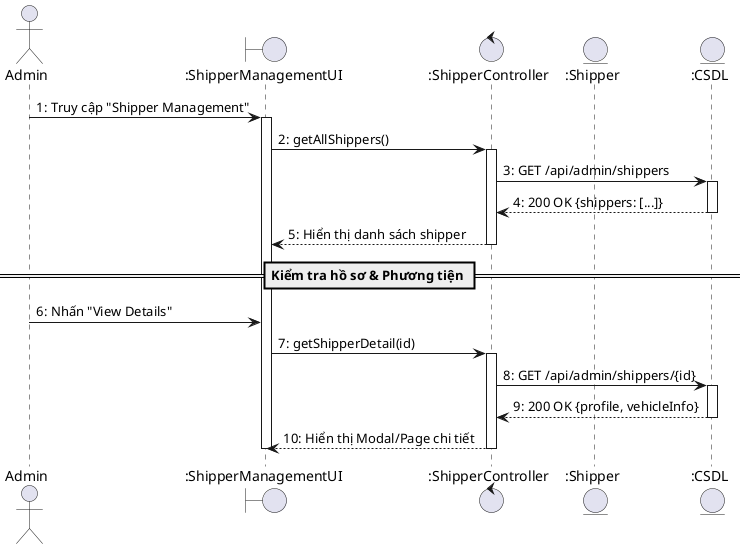

# Sequence Diagram – Shipper Management (Admin)

## UC-77: Quản lý đối tác tài xế (Shippers)

```plantuml
@startuml UC77_AdminQuanLyShipper
actor Admin
boundary ":ShipperManagementUI" as UI
control ":ShipperController" as CTRL
entity ":Shipper" as ENT
entity ":CSDL" as DB

Admin -> UI : 1: Truy cập "Shipper Management"
activate UI

UI -> CTRL : 2: getAllShippers()
activate CTRL
CTRL -> DB : 3: GET /api/admin/shippers
activate DB
DB --> CTRL : 4: 200 OK {shippers: [...]}
deactivate DB
CTRL --> UI : 5: Hiển thị danh sách shipper
deactivate CTRL

== Kiểm tra hồ sơ & Phương tiện ==
Admin -> UI : 6: Nhấn "View Details"
UI -> CTRL : 7: getShipperDetail(id)
activate CTRL
CTRL -> DB : 8: GET /api/admin/shippers/{id}
activate DB
DB --> CTRL : 9: 200 OK {profile, vehicleInfo}
deactivate DB
CTRL --> UI : 10: Hiển thị Modal/Page chi tiết
deactivate CTRL

deactivate UI
@enduml
```
