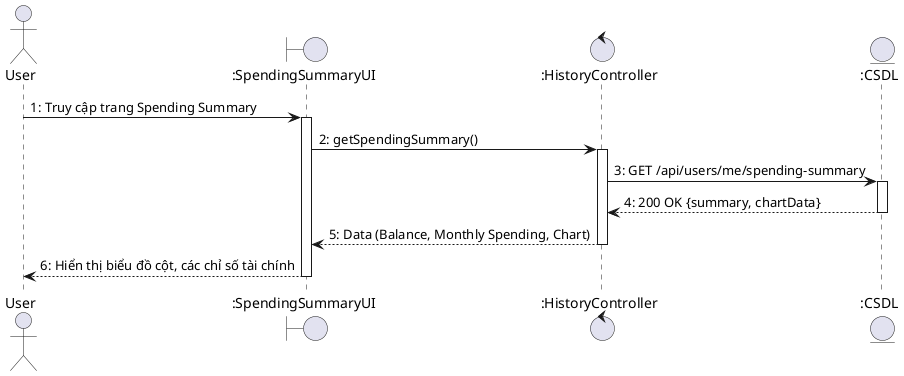
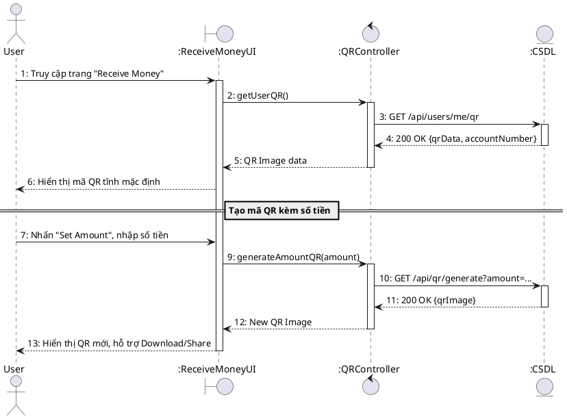
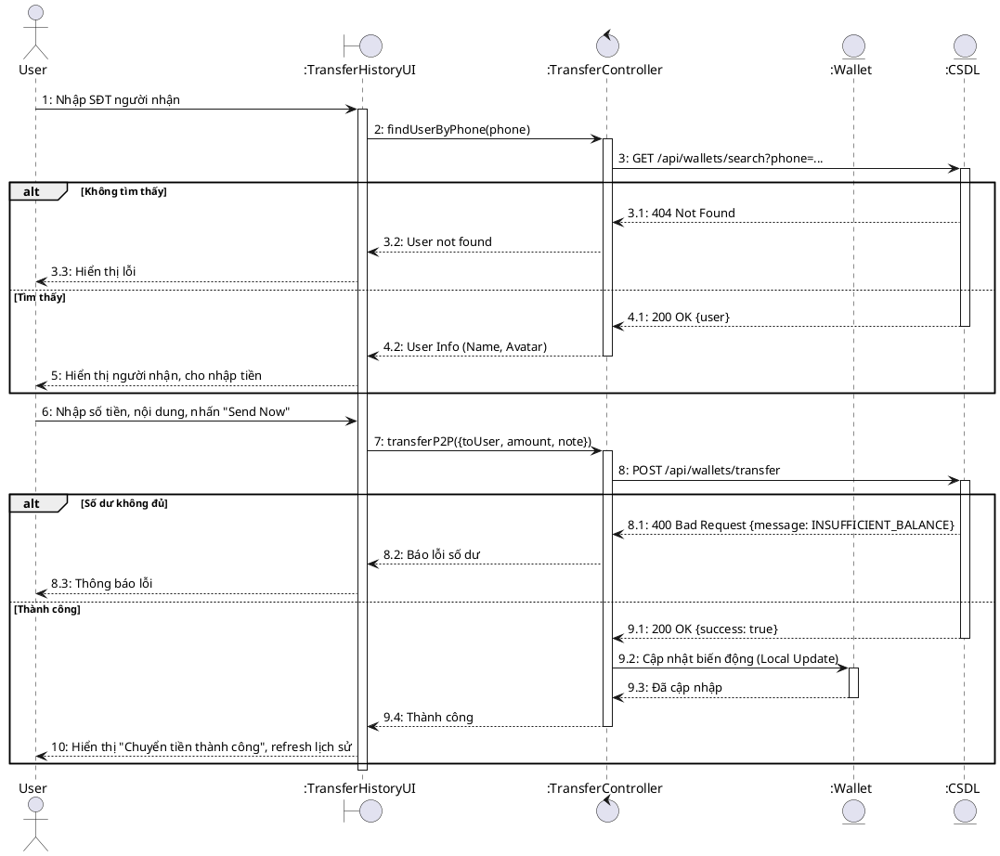
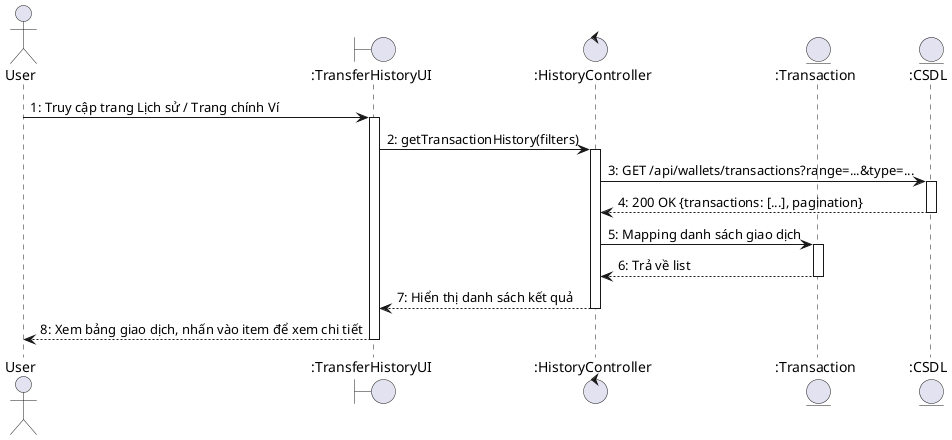

# Sequence Diagram – User Spending Summary & Wallet Features

## UC-66: Phân tích biểu đồ chi tiêu (Spending Summary)

## UC-67: Nhận tiền qua mã QR

## UC-68: Chuyển tiền qua SĐT (P2P Transfer)

## UC-69: Tra cứu lịch sử giao dịch

