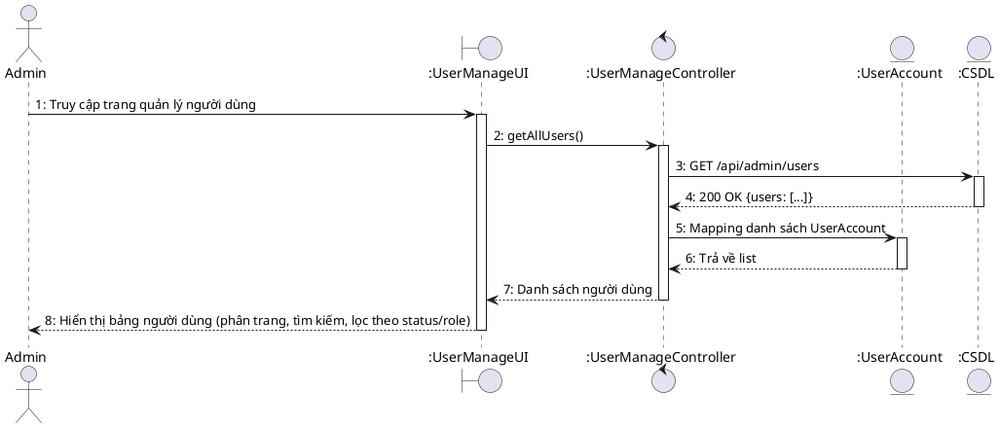
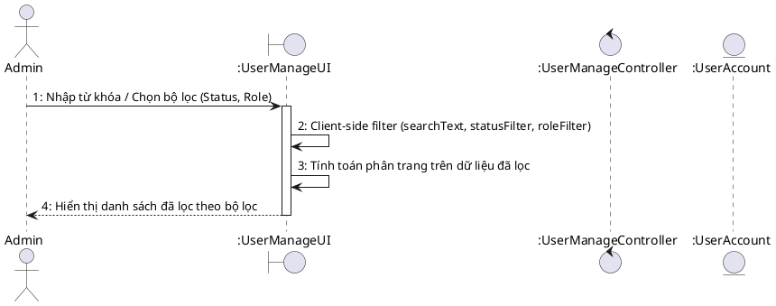
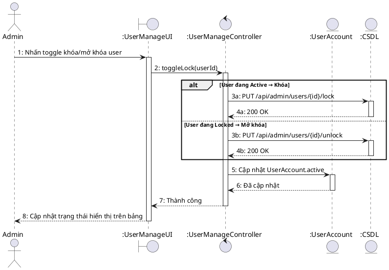

# Sequence Diagram – UserManagePage.jsx

## UC-20: Xem danh sách người dùng (Admin)

```plantuml
@startuml UC20_XemDanhSachUser
actor Admin
boundary ":UserManageUI" as UI
control ":UserManageController" as CTRL
entity ":UserAccount" as ENT
entity ":CSDL" as DB

Admin -> UI : 1: Truy cập trang quản lý người dùng
activate UI

UI -> CTRL : 2: getAllUsers()
activate CTRL

CTRL -> DB : 3: GET /api/admin/users
activate DB
DB --> CTRL : 4: 200 OK {users: [...]}
deactivate DB

CTRL -> ENT : 5: Mapping danh sách UserAccount
activate ENT
ENT --> CTRL : 6: Trả về list
deactivate ENT

CTRL --> UI : 7: Danh sách người dùng
deactivate CTRL

UI --> Admin : 8: Hiển thị bảng người dùng (phân trang, tìm kiếm, lọc theo status/role)
deactivate UI
@enduml
```

## UC-21: Tìm kiếm và lọc người dùng

```plantuml
@startuml UC21_TimKiemUser
actor Admin
boundary ":UserManageUI" as UI
control ":UserManageController" as CTRL
entity ":UserAccount" as ENT

Admin -> UI : 1: Nhập từ khóa / Chọn bộ lọc (Status, Role)
activate UI

UI -> UI : 2: Client-side filter (searchText, statusFilter, roleFilter)
UI -> UI : 3: Tính toán phân trang trên dữ liệu đã lọc

UI --> Admin : 4: Hiển thị danh sách đã lọc theo bộ lọc
deactivate UI
@enduml
```

## UC-22: Khóa / Mở khóa tài khoản

```plantuml
@startuml UC22_KhoaMoKhoaUser
actor Admin
boundary ":UserManageUI" as UI
control ":UserManageController" as CTRL
entity ":UserAccount" as ENT
entity ":CSDL" as DB

Admin -> UI : 1: Nhấn toggle khóa/mở khóa user
activate UI

UI -> CTRL : 2: toggleLock(userId)
activate CTRL

alt User đang Active → Khóa
    CTRL -> DB : 3a: PUT /api/admin/users/{id}/lock
    activate DB
    DB --> CTRL : 4a: 200 OK
    deactivate DB
else User đang Locked → Mở khóa
    CTRL -> DB : 3b: PUT /api/admin/users/{id}/unlock
    activate DB
    DB --> CTRL : 4b: 200 OK
    deactivate DB
end

CTRL -> ENT : 5: Cập nhật UserAccount.active
activate ENT
ENT --> CTRL : 6: Đã cập nhật
deactivate ENT

CTRL --> UI : 7: Thành công
deactivate CTRL

UI --> Admin : 8: Cập nhật trạng thái hiển thị trên bảng
deactivate UI
@enduml
```
