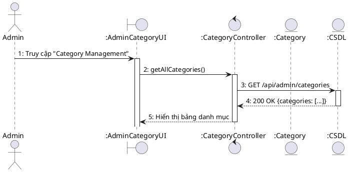

# Sequence Diagram – Vendor (Category) Management

## UC-65: Quản lý danh mục sản phẩm (Category)

```plantuml
@startuml UC65_AdminQuanLyDanhMuc
actor Admin
boundary ":AdminCategoryUI" as UI
control ":CategoryController" as CTRL
entity ":Category" as ENT
entity ":CSDL" as DB

Admin -> UI : 1: Truy cập "Category Management"
activate UI

UI -> CTRL : 2: getAllCategories()
activate CTRL
CTRL -> DB : 3: GET /api/admin/categories
activate DB
DB --> CTRL : 4: 200 OK {categories: [...]}
deactivate DB
CTRL --> UI : 5: Hiển thị bảng danh mục
deactivate CTRL
@enduml
```
