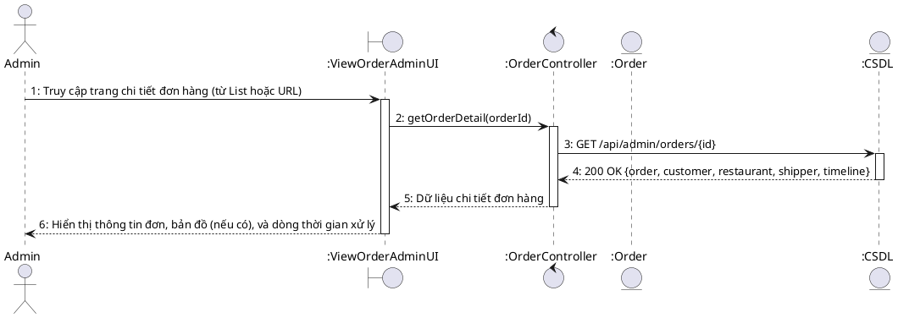

# Sequence Diagram – View Order Detail (Admin)

## UC-80: Xem chi tiết đơn hàng toàn hệ thống

```plantuml
@startuml UC80_AdminChiTietDonHang
actor Admin
boundary ":ViewOrderAdminUI" as UI
control ":OrderController" as CTRL
entity ":Order" as ENT
entity ":CSDL" as DB

Admin -> UI : 1: Truy cập trang chi tiết đơn hàng (từ List hoặc URL)
activate UI

UI -> CTRL : 2: getOrderDetail(orderId)
activate CTRL
CTRL -> DB : 3: GET /api/admin/orders/{id}
activate DB
DB --> CTRL : 4: 200 OK {order, customer, restaurant, shipper, timeline}
deactivate DB
CTRL --> UI : 5: Dữ liệu chi tiết đơn hàng
deactivate CTRL

UI --> Admin : 6: Hiển thị thông tin đơn, bản đồ (nếu có), và dòng thời gian xử lý

deactivate UI
@enduml
```
