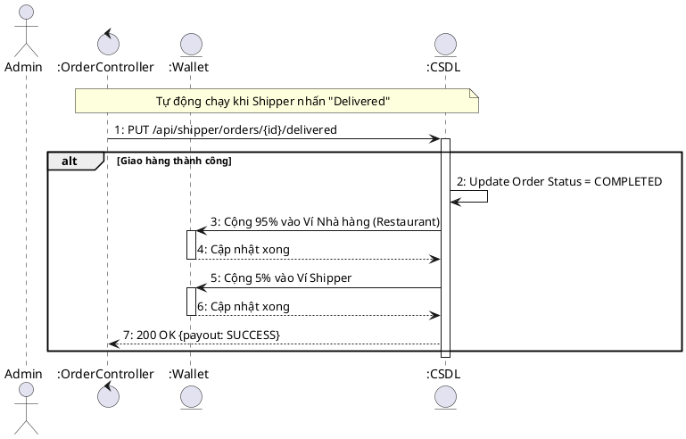
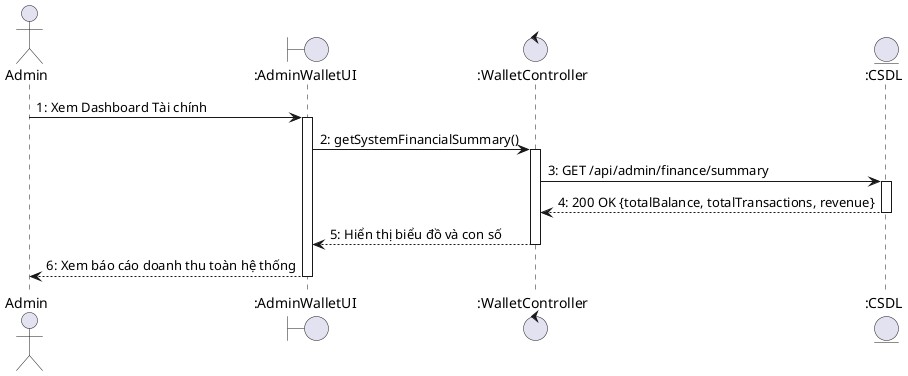

# Sequence Diagram – Wallet Finance & Revenue Split

## UC-78: Phân phối doanh thu tự động (95/5)

```plantuml
@startuml UC78_PhanPhoiDoanhThu
actor Admin
control ":OrderController" as CTRL
entity ":Wallet" as WALT
entity ":CSDL" as DB

NOTE over CTRL, DB: Tự động chạy khi Shipper nhấn "Delivered"

CTRL -> DB : 1: PUT /api/shipper/orders/{id}/delivered
activate DB

alt Giao hàng thành công
    DB -> DB : 2: Update Order Status = COMPLETED
    
    DB -> WALT : 3: Cộng 95% vào Ví Nhà hàng (Restaurant)
    activate WALT
    WALT --> DB : 4: Cập nhật xong
    deactivate WALT
    
    DB -> WALT : 5: Cộng 5% vào Ví Shipper
    activate WALT
    WALT --> DB : 6: Cập nhật xong
    deactivate WALT
    
    DB --> CTRL : 7: 200 OK {payout: SUCCESS}
end
deactivate DB

@enduml
```

## UC-79: Tổng kết tài chính Admin

```plantuml
@startuml UC79_AdminTaiChinh
actor Admin
boundary ":AdminWalletUI" as UI
control ":WalletController" as CTRL
entity ":CSDL" as DB

Admin -> UI : 1: Xem Dashboard Tài chính
activate UI

UI -> CTRL : 2: getSystemFinancialSummary()
activate CTRL
CTRL -> DB : 3: GET /api/admin/finance/summary
activate DB
DB --> CTRL : 4: 200 OK {totalBalance, totalTransactions, revenue}
deactivate DB
CTRL --> UI : 5: Hiển thị biểu đồ và con số
deactivate CTRL

UI --> Admin : 6: Xem báo cáo doanh thu toàn hệ thống
deactivate UI
@enduml
```
