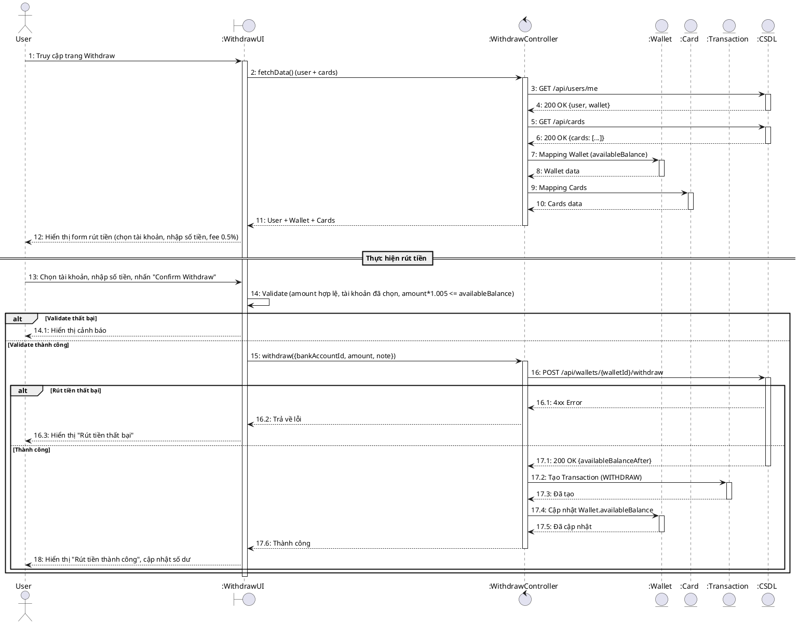

# Sequence Diagram – Withdraw.jsx

## UC-29: Rút tiền từ ví về thẻ ngân hàng

```plantuml
@startuml UC29_RutTien
actor User
boundary ":WithdrawUI" as UI
control ":WithdrawController" as CTRL
entity ":Wallet" as ENTW
entity ":Card" as ENTC
entity ":Transaction" as ENTT
entity ":CSDL" as DB

User -> UI : 1: Truy cập trang Withdraw
activate UI

UI -> CTRL : 2: fetchData() (user + cards)
activate CTRL

CTRL -> DB : 3: GET /api/users/me
activate DB
DB --> CTRL : 4: 200 OK {user, wallet}
deactivate DB

CTRL -> DB : 5: GET /api/cards
activate DB
DB --> CTRL : 6: 200 OK {cards: [...]}
deactivate DB

CTRL -> ENTW : 7: Mapping Wallet (availableBalance)
activate ENTW
ENTW --> CTRL : 8: Wallet data
deactivate ENTW

CTRL -> ENTC : 9: Mapping Cards
activate ENTC
ENTC --> CTRL : 10: Cards data
deactivate ENTC

CTRL --> UI : 11: User + Wallet + Cards
deactivate CTRL

UI --> User : 12: Hiển thị form rút tiền (chọn tài khoản, nhập số tiền, fee 0.5%)

== Thực hiện rút tiền ==
User -> UI : 13: Chọn tài khoản, nhập số tiền, nhấn "Confirm Withdraw"

UI -> UI : 14: Validate (amount hợp lệ, tài khoản đã chọn, amount*1.005 <= availableBalance)

alt Validate thất bại
    UI --> User : 14.1: Hiển thị cảnh báo
else Validate thành công
    UI -> CTRL : 15: withdraw({bankAccountId, amount, note})
    activate CTRL

    CTRL -> DB : 16: POST /api/wallets/{walletId}/withdraw
    activate DB

    alt Rút tiền thất bại
        DB --> CTRL : 16.1: 4xx Error
        CTRL --> UI : 16.2: Trả về lỗi
        UI --> User : 16.3: Hiển thị "Rút tiền thất bại"
    else Thành công
        DB --> CTRL : 17.1: 200 OK {availableBalanceAfter}
        deactivate DB

        CTRL -> ENTT : 17.2: Tạo Transaction (WITHDRAW)
        activate ENTT
        ENTT --> CTRL : 17.3: Đã tạo
        deactivate ENTT

        CTRL -> ENTW : 17.4: Cập nhật Wallet.availableBalance
        activate ENTW
        ENTW --> CTRL : 17.5: Đã cập nhật
        deactivate ENTW

        CTRL --> UI : 17.6: Thành công
        deactivate CTRL

        UI --> User : 18: Hiển thị "Rút tiền thành công", cập nhật số dư
    end
end

deactivate UI
@enduml
```
