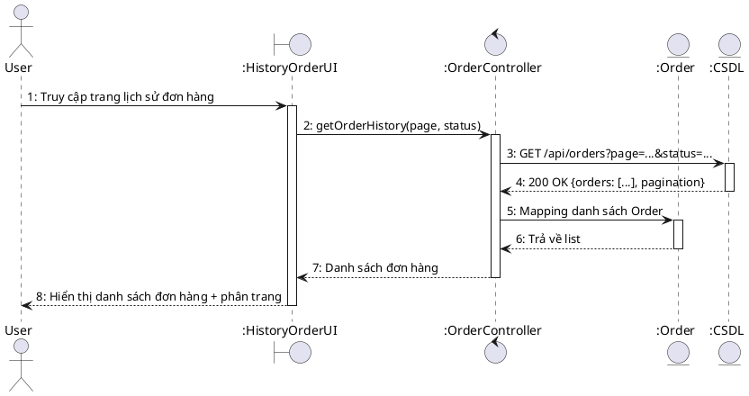
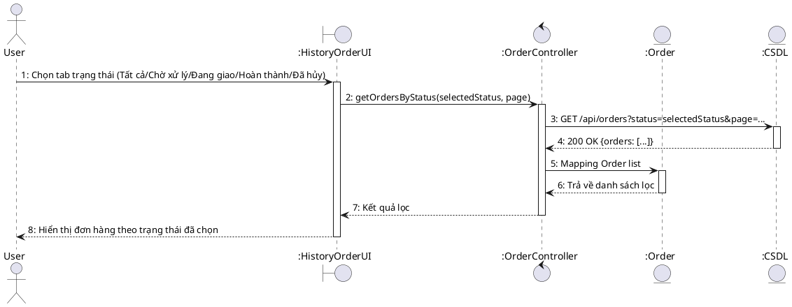

# Sequence Diagram – historyorderbyuser.jsx

## UC-15: Xem lịch sử đơn hàng

```plantuml
@startuml UC15_XemLichSuDonHang
actor User
boundary ":HistoryOrderUI" as UI
control ":OrderController" as CTRL
entity ":Order" as ENT
entity ":CSDL" as DB

User -> UI : 1: Truy cập trang lịch sử đơn hàng
activate UI

UI -> CTRL : 2: getOrderHistory(page, status)
activate CTRL

CTRL -> DB : 3: GET /api/orders?page=...&status=...
activate DB
DB --> CTRL : 4: 200 OK {orders: [...], pagination}
deactivate DB

CTRL -> ENT : 5: Mapping danh sách Order
activate ENT
ENT --> CTRL : 6: Trả về list
deactivate ENT

CTRL --> UI : 7: Danh sách đơn hàng
deactivate CTRL

UI --> User : 8: Hiển thị danh sách đơn hàng + phân trang
deactivate UI
@enduml
```

## UC-16: Lọc đơn hàng theo trạng thái

```plantuml
@startuml UC16_LocDonHang
actor User
boundary ":HistoryOrderUI" as UI
control ":OrderController" as CTRL
entity ":Order" as ENT
entity ":CSDL" as DB

User -> UI : 1: Chọn tab trạng thái (Tất cả/Chờ xử lý/Đang giao/Hoàn thành/Đã hủy)
activate UI

UI -> CTRL : 2: getOrdersByStatus(selectedStatus, page)
activate CTRL

CTRL -> DB : 3: GET /api/orders?status=selectedStatus&page=...
activate DB
DB --> CTRL : 4: 200 OK {orders: [...]}
deactivate DB

CTRL -> ENT : 5: Mapping Order list
activate ENT
ENT --> CTRL : 6: Trả về danh sách lọc
deactivate ENT

CTRL --> UI : 7: Kết quả lọc
deactivate CTRL

UI --> User : 8: Hiển thị đơn hàng theo trạng thái đã chọn
deactivate UI
@enduml
```
