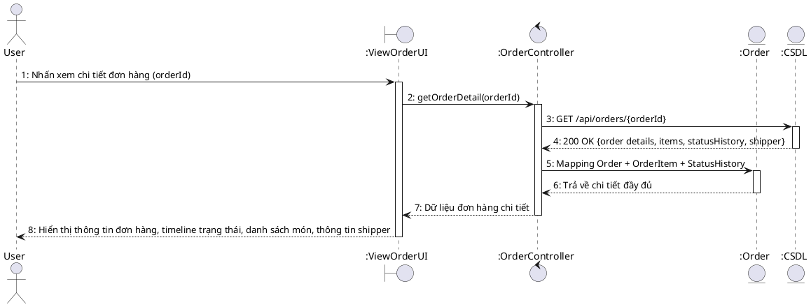
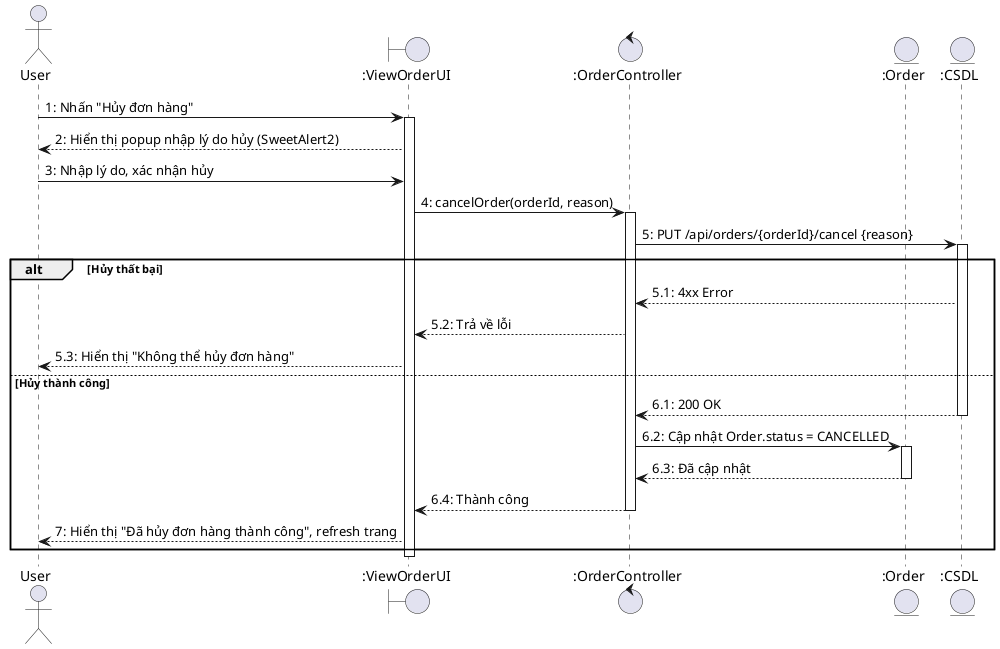
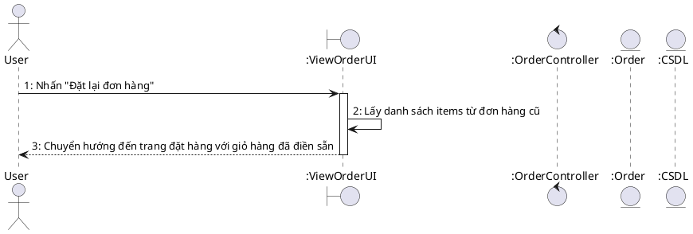

# Sequence Diagram – vieworder.jsx

## UC-17: Xem chi tiết đơn hàng

```plantuml
@startuml UC17_XemChiTietDonHang
actor User
boundary ":ViewOrderUI" as UI
control ":OrderController" as CTRL
entity ":Order" as ENT
entity ":CSDL" as DB

User -> UI : 1: Nhấn xem chi tiết đơn hàng (orderId)
activate UI

UI -> CTRL : 2: getOrderDetail(orderId)
activate CTRL

CTRL -> DB : 3: GET /api/orders/{orderId}
activate DB
DB --> CTRL : 4: 200 OK {order details, items, statusHistory, shipper}
deactivate DB

CTRL -> ENT : 5: Mapping Order + OrderItem + StatusHistory
activate ENT
ENT --> CTRL : 6: Trả về chi tiết đầy đủ
deactivate ENT

CTRL --> UI : 7: Dữ liệu đơn hàng chi tiết
deactivate CTRL

UI --> User : 8: Hiển thị thông tin đơn hàng, timeline trạng thái, danh sách món, thông tin shipper
deactivate UI
@enduml
```

## UC-18: Hủy đơn hàng

```plantuml
@startuml UC18_HuyDonHang
actor User
boundary ":ViewOrderUI" as UI
control ":OrderController" as CTRL
entity ":Order" as ENT
entity ":CSDL" as DB

User -> UI : 1: Nhấn "Hủy đơn hàng"
activate UI

UI --> User : 2: Hiển thị popup nhập lý do hủy (SweetAlert2)
User -> UI : 3: Nhập lý do, xác nhận hủy

UI -> CTRL : 4: cancelOrder(orderId, reason)
activate CTRL

CTRL -> DB : 5: PUT /api/orders/{orderId}/cancel {reason}
activate DB

alt Hủy thất bại
    DB --> CTRL : 5.1: 4xx Error
    CTRL --> UI : 5.2: Trả về lỗi
    UI --> User : 5.3: Hiển thị "Không thể hủy đơn hàng"
else Hủy thành công
    DB --> CTRL : 6.1: 200 OK
    deactivate DB

    CTRL -> ENT : 6.2: Cập nhật Order.status = CANCELLED
    activate ENT
    ENT --> CTRL : 6.3: Đã cập nhật
    deactivate ENT

    CTRL --> UI : 6.4: Thành công
    deactivate CTRL

    UI --> User : 7: Hiển thị "Đã hủy đơn hàng thành công", refresh trang
end

deactivate UI
@enduml
```

## UC-19: Đặt lại đơn hàng (Reorder)

```plantuml
@startuml UC19_DatLaiDonHang
actor User
boundary ":ViewOrderUI" as UI
control ":OrderController" as CTRL
entity ":Order" as ENT
entity ":CSDL" as DB

User -> UI : 1: Nhấn "Đặt lại đơn hàng"
activate UI

UI -> UI : 2: Lấy danh sách items từ đơn hàng cũ
UI --> User : 3: Chuyển hướng đến trang đặt hàng với giỏ hàng đã điền sẵn

deactivate UI
@enduml
```
